Article

https://doi.org/10.1038/s41467-024-52123-w

# Role of grain-level chemo-mechanics in composite cathode degradation of solidstate lithium batteries

Received: 9 February 2024

Accepted: 23 August 2024

Chuanlai Liu 1 , Franz Roters 1 & Dierk Raabe 1

Published online: 12 September 2024

Check for updates

Solid-state Li-ion batteries, based on Ni-rich oxide cathodes and Li-metal anodes, can theoretically reach a high specific energy of 393 Wh kg−1 and hold promise for electrochemical storage. However, Li intercalation-induced dimensional changes can lead to crystal defect formation in these cathodes, and contact mechanics problems between cathode and solid electrolyte. Understanding the interplay between cathode microstructure, operating conditions, micromechanics ofbattery materials, and capacity decay remains a challenge. Here, we present a microstructure-sensitive chemo-mechanical model to study the impact ofgrain-level chemo-mechanics on the degradation of composite cathodes. We reveal that crystalline anisotropy, state-of-chargedependent Li diffusion rates, and lattice dimension changes drive dislocation formation in cathodes and contact loss at the cathode/electrolyte interface. These dislocations induce large lattice strain and trigger oxygen loss and structural degradation preferentially near the surface area of cathode particles. Moreover, contact loss is caused by the micromechanics resulting from the crystalline anisotropy of cathodes and the mechanical properties of solid electrolytes, not just operating conditions. These findings highlight the significance of grain-level cathode microstructures in causing cracking, formation of crystal defects, and chemo-mechanical degradation of solid-state batteries.

Ni-rich layered oxide positive electrodes (cathodes) can yield a substantial increase in energy density of solid-state Li-ion batteries, but they suffer from contact loss, and irreversible layered-to-spinel or disordered rock-salt-like phase transition1–8. These structural degradation mechanisms have been mainly attributed to oxygen loss and out-of-plane transition metal (TM) migration arising from cathode/ electrolyte interfacial side reactions3,9–12. Cathode particle surface modification or coating techniques could partially alleviate interfacial degradation13–15, however, the effectiveness of these strategies has proven insufficient to mitigate structural degradation in the bulk of cathode materials2,4,5,16,17. This dilemma raises the suspicion that the electrochemical instability of the cathode/electrolyte interface may not be the main cause behind the progressive capacity degradation observed over cycling. One of the critical aspects of solid-state batteries is the stress response of their complex microstructure to large volume changes (strains) driven by Li intercalation.

For the layered oxide cathode, Li-ions intercalate into the host structure, creating a gradient in the lattice parameter and a concurrent non-uniform elastic strain and large volume change (7.8% volume change for $\mathbf { L i N i _ { 0 . 8 } M n _ { 0 . 1 } C o _ { 0 . 1 } O _ { 2 } ( N M C 8 1 1 ) ^ { 8 , 1 8 , 1 9 } } )$ . The high-stress buildup resulting from Li transport and crystalline anisotropy inevitably leads to contact loss and the formation of crystal defects in cathodes, in particular dislocations and stacking faults4,6,20–27, as sketched in Fig. 1. The appearance of crystal defects in ion-insertion materials can generate heterogeneous nanoscale lattice strain and modify the local bonding environment, for example, the number of covalent bonding partners for oxygen, as revealed by coherent X-ray diffraction and atomic-scale characterisation4–6,20–22,26. The metal-oxygen decoordination owing to defects leads to significant changes in the local electronic structure, and can even change the relative ordering of electronic states4,22,28,29. Although the exact nature of the defect-induced bonding environment change is debated and may vary among different materials, such as Ni-rich and Li-rich layered oxides, the large lattice strain associated with crystal defects can markedly reduce the energy barriers to remove lattice oxygen and trigger Li/TM ion mixing4,22,28–31. Therefore, besides the electrochemical instability of the cathode/ electrolyte interface, the continuous accumulation ofcrystal defects in cathode particles due to Li (de)intercalation over cycling acts as the primary driving force for aggravating oxygen loss and altering the structural stability.

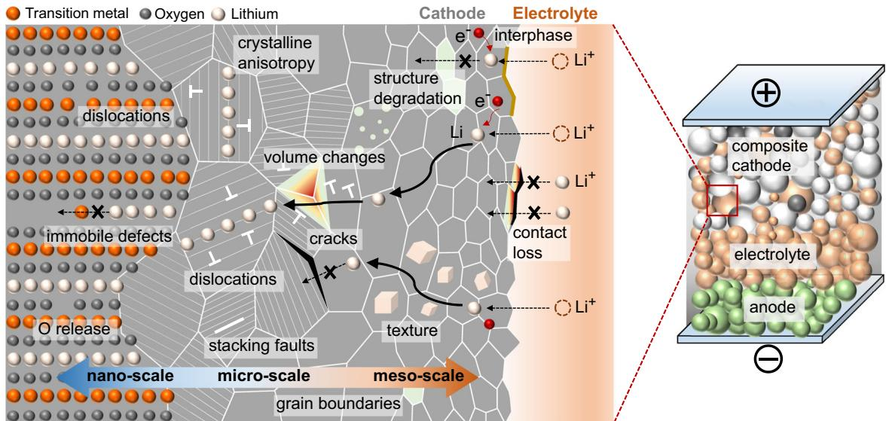  
Fig. 1 | Schematic view ofelectrochemical reaction, Li intercalation, structural degradation, and lattice defect types in composite cathodes of solid-state battery cells: point defects (zero-dimensional (0D) defects), dislocations (onedimensional (1D) defects) and interfaces (two-dimensional (2D) defects). Key to solving the challenges of the cathode/electrolyte interface, crystal defect formation, and structural degradation in cathodes is a clear understanding ofthe chemomechanics of the composite cathodes across battery-relevant length scales. Non-  
uniform volume changes resulting from Li intercalation and the crystalline anisotropy of primary cathode particles lead to high stress, contact loss, and crystal defect accumulation, in particular dislocations and stacking faults. The presence of crystal defects can markedly reduce the energy barriers to remove lattice oxygen, which triggers Li/TM ion mixing and structural degradation. The large compositional strains in cathodes result in contact mechanics problems between cathodes and solid electrolytes.

The solid-state batteries must be able to operate within a wide range ofcharging and discharging times, ranging from ultra-fast pulses to slow discharging over the course of multiple days. The various compositional strains imposed by these different (dis)charging rates can significantly affect the evolution of grain-level stress and strain responses in composite cathodes. Key to solving the challenges of the cathode/electrolyte interface and crystal defect formation in cathodes is a clear understanding of the chemo-mechanics of the composite cathodes across battery-relevant length scales and strain rates. Highresolution transmission electron microscopy (HRTEM) experiments and atomic-scale simulations reveal that dislocations resulting from heterogeneous Li intercalation can trigger irreversible migration ofTM ions into octahedral sites in the Li layer and subsequent structural degradation4–6,20–22,26,29. Chemo-mechanical simulations using cohesive zone models and phase-field damage models have advanced the understanding of the microscopic mechanical fracture behaviour in electrode materials32–44. However, the assessment of how microstructure and (dis)charging protocols affect the formation of crystal defects and defect-induced structural degradation at the grain level in composite cathodes remains unexplored. This gap in knowledge is primarily due to the limitations and efforts associated with the application of advanced and standardised analytical techniques in probing cathodes and their environments across various length scales4,5.

In this work, we have therefore developed a meso-scale chemomechanical constitutive model by integrating the interplay between electrochemical reaction, anisotropic Li-ion intercalation, cathode microstructure, grain-level micromechanics and formation of crystal defects resulting from lattice dimension changes4,5,28,29. We apply it to systematically investigate the impact of cathode microstructure, mechanical properties of solid electrolyte, and operating conditions on the evolution of stress and strain responses, generation of dislocations, as well as the associated oxygen loss and structural degradation mechanisms. Our work provides insights into the impact of grain-level chemo-mechanics on the degradation of Ni-rich composite cathodes, aiming at providing a quantitative simulation methodology for mitigating capacity loss of solid-state batteries.

## Results

## Theoretical framework and model setup

The workflow of the electrochemical reaction-diffusion model and dislocation-based micromechanical model, informed by nanoscale experimental and theoretical findings4,5,12,16,28,29, is shown in Fig. 2. A thermodynamically consistent chemo-mechanical model is derived within the finite strain framework, which is suitable for addressing the large volume change induced by Li intercalation in Ni-rich NMC cathodes8,18,19. The model incorporates anisotropic and concentrationdependent material properties, providing an accurate representation of the composite cathode behaviour. An in-house large-scale parallel finite element solver, using the PETSc numerical library45, was developed to discretize the model and efficiently solve the coupled governing equations46,47. The model is implemented in the freeware simulation package DAMASK48. The section Methods provides a detailed description ofmodel formulation, numerical implementation, and model parametrization. The procedure comprises three essential steps:

(1) A three-dimensional representative volume element is employed to describe the composite cathode microstructure, as shown in Fig. 2c and Supplementary Fig. S1. NMC secondary particles synthesised by the co-precipitation method typically consist of many randomly oriented primary particles49,50. However, modifying the surface energies through a boron doping strategy can induce the directional growth of primary particles, resulting in NMC secondary particles with radially aligned primary particles51,52. In this study, an isolated Ni-rich NMC811 polycrystal particle, consisting of 200 randomly oriented primary particles, is embedded in the uniform solid electrolyte. The polycrystalline cathode particle maintains electrical neutrality as it is assumed to be connected to the current collector via the carbon binder of the composite cathode.

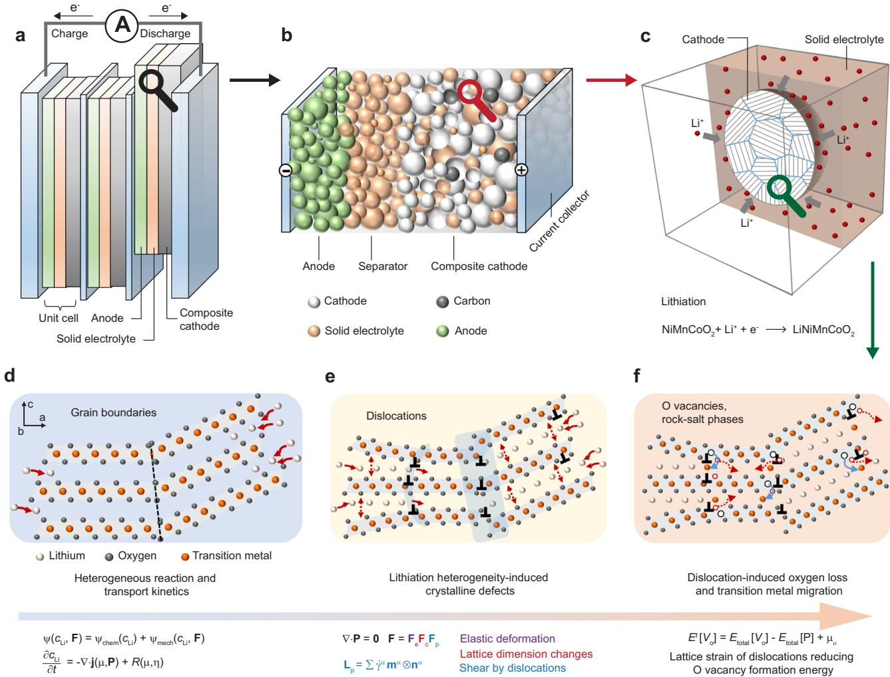  
Fig. 2 | Workflow of the reaction-diffusion-micromechanics and dislocation induced structural degradation model for composite cathode materials. informed by nanoscale experimental and theoretical findings. a Concept of a bipolar-stacked Li solid-state battery cell. b Schematic of a unit cell featuring composite cathode materials. c Representative volume element describing the microstructure of composite cathodes. d Application of a Cahn-Hilliard diffusion  
reaction model to describe the electro-chemical reactions and Li (de)intercalation in the a-b plane, e Generation of various crystal defects, such as basal dislocations. arising from the anisotropic lattice dimension changes due to Li (de)intercalation. The coupling of Li composition and dislocation generation is described by a micromechanical constitutive law. f The presence of dislocations resulting from Li mass transport facilitates oxygen removal and Li/TM ion mixing.

(2) A grain-level chemo-mechanical model is developed to describe the electrochemical reaction, Li intercalation, lattice dimension changes, and dislocation formation. The Cahn-Hilliard reactiondiffusion equation46,53,54 is employed to describe the electrochemical reaction at the cathode/solid-electrolyte interface, and Li intercalation within the cathode. Li-ion transport inside the solid electrolyte is not considered explicitly since we only simulate (dis)charge processes at constant currents. The composite cathode is working under the galvanostatic discharge or charge condition, i e. a constant Li flux into or out of the NMC secondary particle. A Li occupancy fraction of 0.1 or 0.9 in the NMC cathodes is taken as the stress-free state, respectively. For each primary particle within the secondary particle, the layered structure of the oxide cathode permits Li diffusion exclusively within the basal crystallographic plane, with diffusivity depending on the state-of-charge (Fig. 3c). To accommodate the anisotropic lattice dimension changes resulting from Li (de)intercalation, misfit dislocations in cathodes are usually generated (Fig. 2d, e), which is described by the crystal plasticity mechanical model47,55. Only isotropic elastic deformation is allowed for the solid electrolyte. While the present study uses the maximum principal stress distribution to analyse contact mechanics problems, the current model does not explicitly account for mechanical fracture.

(3) The impact of lattice strain resulting from dislocations on oxygen deficiency in the NMC cathode can be assessed via calculating the formation energy of oxygen vacancies under an applied mechanical strain4,28,29 (Fig. 2f). Atomic-scale calculations reveal that the formation energy of oxygen vacancies in layered oxide cathodes is significantly reduced when the applied tensile strain approaches 10% 4,22,28,29. In this study, material domains with a plastic shear exceeding 12% in cathode particles after discharge are categorised as the oxygen-deficient phase. This threshold is determined based on the atomic-scale calculations4,22,28,29 and by fitting the predicted distribution of oxygen-deficient phase in the secondary particle to experimental characterisation5. The formation of such an oxygendeficient phase in cathode particles will impede the Li-ion intercalation pathways within the cathodes for subsequent cycling. We

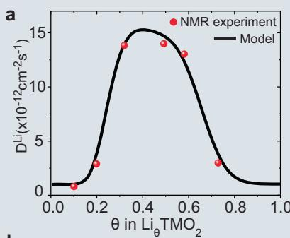

d Isotropic, discharge  
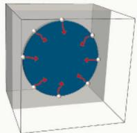  
e Single crystal, discharge

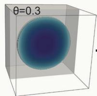  
b

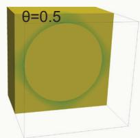

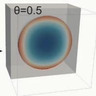

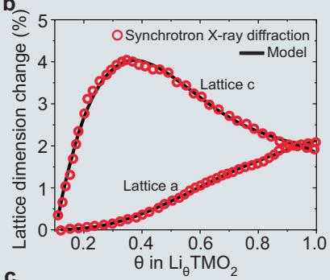

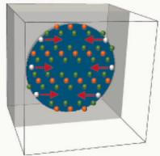  
f Polycrystal, discharge

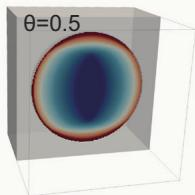

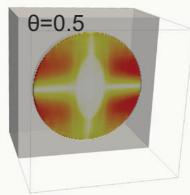

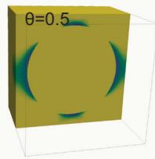

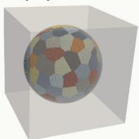

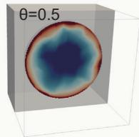

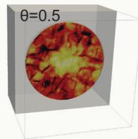

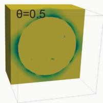

c  
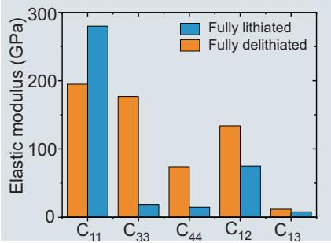

g Polycrystal, charge  
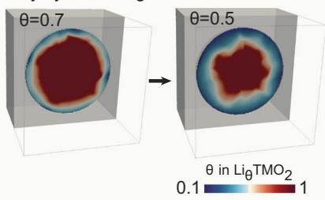

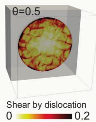

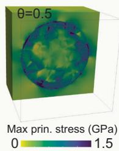

h  
i  
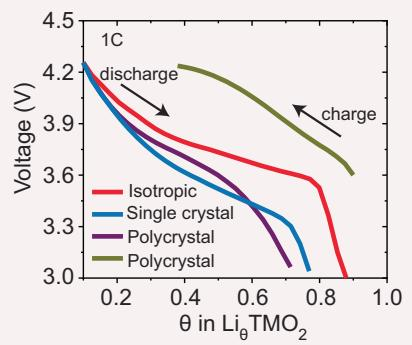

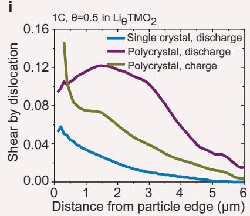

j  
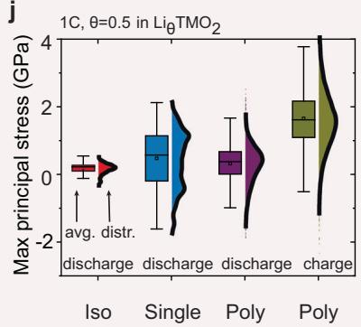  
Fig. 3 | Effect ofanisotropic and concentration-dependent electrochemical and mechanical properties ofNMC cathodes in Li-ion dynamics, dislocation formation, interface mechanics, and electrochemical performance. a Li concentration-dependent diffusivity on the basal plane¹8. b Anisotropic and Li concentration-dependent lattice dimension changes18,57. c Elastic stiffness parameters at fully lithiated and delithiated states58–60. d–g Distribution of Li concentration, dislocation-induced shear, and maximum principle stress at 1 C, within a  
cathode particle with isotropic and constant material properties (d), within a single crystal particle (e), a polycrystal particle (f) under discharge, and a polycrystal particle under charge (g), all with anisotropic and concentration-dependent material properties. h Voltage-capacity profiles under discharge and charge. i The average dislocation-induced shear deformation as a function of distance from the particle edge.j Statistical variability in the maximum principle stress distribution at the cathode/solid-electrolyte interface.

assume that the cathode particle is fully delithiated and lithiated when the average Li occupancy in the cathode is 0.1 and 0.99, respectively. The practical absolute discharge capacity of the NMC811 cathode is 203 mAhg−1 56. The normalised capacity is defined as the discharge capacity at the cut-off voltage of 3 V normalised to the practical absolute capacity. The total normalized capacity loss at a specific current consists of two components: thermodynamic capacity loss due to the irreversible loss of active materials and kinetically induced capacity loss, which arises from non-uniform Li distribution within the particles, characterized by Lirich peripheries and Li-poor cores.

## Role of anisotropic and concentration-dependent electro chemical and mechanical properties

We now investigate the role of anisotropic and concentrationdependent Li diffusivity, elastic stiffness, and lattice dimension changes in Li-ion dynamics, dislocation formation, mechanical failure, and capacity loss in composite cathode materials. A Ni-rich NMC811 particle with a diameter of 12 μm is embedded in the $\mathrm { L i } _ { 6 . 6 } \mathrm { L a } _ { 3 } \mathrm { T a } _ { 0 . 4 } \mathrm { Z r } _ { 1 . 6 } \mathrm { O } _ { 1 2 }$ solid electrolyte. Three types of simulations are performed: (i) a cathode particle with isotropic and constant material properties, (ii) a single crystal cathode particle, and (iii) a polycrystal cathode particle with anisotropic and concentration-dependent material properties. As demonstrated by solid-state nuclear magnetic resonance characterisation, the Li diffusion coefficient drops sharply, over two orders of magnitude, as the Li content exceeds $8 0 \% ^ { 1 8 , 5 7 }$ (Fig. 3a). The atomic lattice dimension change during (dis)charge is measured by operando synchrotron X-ray diffraction (XRD) experiments8,18,19, as shown in Fig. 3b. The a and b lattice parameters increase upon lithiation by maximum 2%. The c lattice parameter exhibits a nonmonotonic behaviour, rapidly increasing at the initial stage of discharge by up to 4%, and then gradually collapsing to 1.95% as the Li site fraction exceeds 0.37. These dimensional changes are attributed to the change ofNi oxidation states, and the modification of the interlayer spacing between the $0 ^ { 2 ^ { - } }$ planes8,18,19. Nanoindentation mechanical experiments and first-principles calculations indicate that delithiation results in a reduction of the elastic modulus ofNMC cathodes (Fig. 3c)58,59. To the authors’ knowledge, the five independent stiffness parameters for NMC811 were only measured or predicted at fully lithiated and delithiated states58–60. The elastic stiffness at a fully lithiated state was used here.

Figure 3d–f shows that anisotropic diffusion and state-of-charge dependent diffusivity result in secondary particles with Li-rich peripheries and Li-poor cores upon lithiation. This heterogeneous Li distribution is insufficient to enable a high Li-ion flux uniformly throughout the particle, thereby leading to a significant increase in overpotential and a consequent sharp reduction in cell voltage during galvanostatic discharge. Therefore, as shown in Fig. 3h, the half cell rapidly approaches the cutoff voltage of 3V, with the inner core of the particle remaining in a Li-deficient state, resulting in a substantial capacity loss. Figure 3h shows that anisotropic and concentrationdependent diffusion results in a normalised capacity loss of 0.12 for single crystal cathodes and 0.18 for polycrystal cathodes at a discharge rate of 1 C, comparing to the isotropic case (nC signifies to a full dis charge to the practical capacity within 1/ hours). Operando optical microscopy observations also confirm the persistent presence of Li heterogeneities within the cathode particle across a wide range of discharge rates57,61.

Figure 3f, g shows that the large anisotropic lattice dimension change of Ni-rich layered cathodes driven by Li intercalation and the cathode microstructure heterogeneity result in substantial differences in dislocation activity and accumulation between primary particles. This indicates that even primary particles of identical size and orientation will exhibit a degree of dislocation activity that highly depends on their location within the agglomerate. Additionally, the sharp drop in Li diffusivity towards higher Li content conditions leads to a pronounced concentration gradient across the secondary particle. This Li heterogeneity can generate a significant difference in lattice dimensions and distortions between the Li-rich and Li-poor domains. Therefore, as shown in Fig. 3i, basal dislocations accumulate prominently near the exterior of the secondary particle, under both discharge and charge conditions. The formation of crystal defects, such as dislocations, will result in high-stress build-up and very large local lattice strains. This effect, in turn, modifies the local bonding environment for oxygen, ultimately promoting oxygen deficiency4,5,20–22,26. The accumulation of these basal dislocations thus facilitates the structural degradation from the layered structure to the spinel-like phase within the agglomerate’s periphery4,5. This structural degradation carries consequences beyond mere active material loss; it hinders the efficient Li transport into or out of the agglomerate’s core. Consequently, this exacerbates the kinetically-induced capacity loss, compounding the adverse effects on the composite cathode’s performance.

Figure 3d–g shows that anisotropic elastic stiffness and lattice dimension changes ofNMC play a pivotal role in contact mechanics at the cathode/solid-electrolyte interface and grain boundaries among primary particles. Figure 3j shows the statistical variability in the maximum principle stress distribution on the cathode/solid-electrolyte interface (driving force for contact loss), before and after considering the effect ofcrystalline anisotropy. Figure 3e, $\mathbf { f } , \mathbf { j }$ suggests that while the cathode particle exhibits volume expansion under discharge, most regions within the cathode/solid-electrolyte interface experience substantial tensile stress due to the anisotropic chemical expansion of primary particles, for both single crystal and polycrystal cathodes. Under the charge condition, Fig. 3g, j shows that the anisotropic deformation of primary particles results in high stresses both at the cathode/solid-electrolyte interface and grain boundaries within the polycrystal cathode particle. This observation indicates that the potential mechanical failure of the cathode/solid-electrolyte interface and primary-particle fragmentation at grain boundaries is driven by the combination of anisotropic lattice dimension changes upon (de) lithiation and microstructure heterogeneity.

## Role of microstructure in rate performance and defect heterogeneity

Insights about the spatial dynamics of Li intercalation and the heterogeneous distribution of crystal defect leverage an improved understanding of the rate performance and electrochemical and mechanical degradation mechanisms of solid-state batteries. Here, we investigate the role of secondary particle size and discharge rate on state-of-charge heterogeneities and dislocation activity in single crystal and polycrystalline NMC cathodes. Figure 4a shows the predicted and experimental voltage-capacity profiles of the polycrystal cathode during galvanostatic discharge tests62, where the discharge rate is gradually increased from 0.1 C to 2 C. Furthermore, as shown in Fig. 4b and Supplementary Figs. S4 and 5, for both single crystal and polycrystalline cathodes, the capacity-rate trade-off can be improved by decreasing the secondary particle size of the cathodes. The good agreement between simulations and experiments confirms the effectiveness of the developed physics-based chemo-mechanical model.

Figure 4d suggests that both single crystal and polycrystalline cathodes exhibit similar spatial dynamics of lithiation across a broad range of discharge rates, from 0.25 C to 5 C. However, there are significant differences in dislocation activity between single-crystalline and polycrystalline cathodes. At a low discharge rate of 0.25 C, we observe a high level of dislocation activity in the polycrystalline particle, while the dislocation activity is relatively low in the single crystal particle. Transitioning a high discharge rate of 5 C, dislocations accu mulate at the edge of both polycrystalline and single crystal particles; however, the polycrystalline particle exhibits a much broader defectrich region. Chemo-mechanical phase-field dislocation modelling and operando synchrotron X-ray diffraction experiments demonstrate that the dimensions and geometries of cathode particles remarkably impact the formation of misfit dislocations in phase-transforming cathodes63–65. Energy-based stability analysis of misfit dislocations reveals that the minimum critical size for dislocation-free $\mathsf { L i F e P O _ { 4 } }$ particles is \~47 nm; below this size, particles are unlikely to host a misfit dislocation at the phase boundary64. Synchrotron X-ray diffraction experiments indicate that large misfit strains can be effectively circumvented in electrodes comprising ${ \bf V } _ { 2 } { \bf O } _ { 5 }$ nanospheres with diameters $\mathbf { o f 4 9 n m } ^ { 6 5 }$ . In the current study, the primary particles in polycrystalline cathodes range from 300 nm to 1 μm in diameter, while single crystal particles range from 2 μm to $1 2 \mu \mathrm { m } .$ . Thus, the size of the cathode particles is above the minimum critical size of dislocation-free particles63–65. Consequently, in this study, plastic shear in the cathodes is mainly driven by anisotropic and heterogeneous compositional strains. The current results suggest that dislocations primarily form as a result of the Li inhomogeneity-induced strain gradient within single crystal particles under high current density conditions. For poly crystalline cathodes, both operating conditions and the random arrangement of primary particles in the secondary particle play a critical role in dislocation heterogeneity. Furthermore, as depicted in Fig. 4c, a positive correlation between the Li concentration and dislocation activity is evident for the single crystal particle, whereas a relatively high dislocation activity is observed in the polycrystalline particle, irrespective of Li content. The particle size-dependent effect on the stability of misfit dislocations should be incorporated into the developed chemo-mechanical model, when the dimension of the electrode particles approaches the critical size63–65.

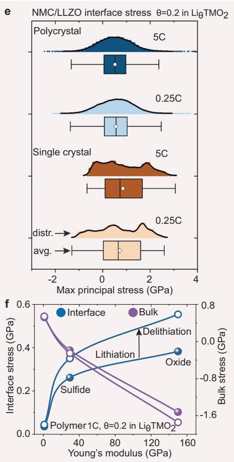

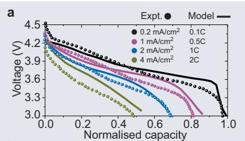  
b

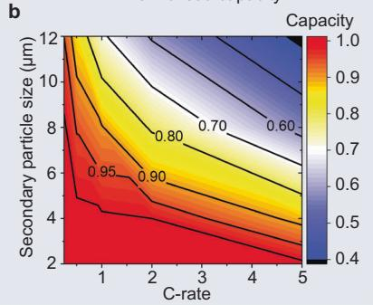  
d

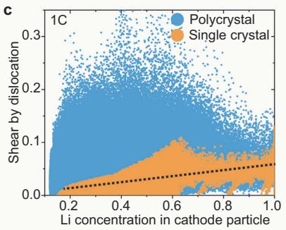

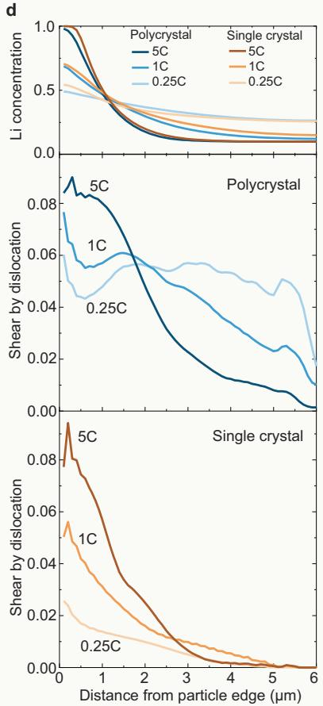  
Fig. 4 | Effect of cathode microstructure and operating conditions on dis location heterogeneity and mechanical stability. a Voltage-capacity profiles at various discharge rates for the polycrystalline cathode with a diameter of 12 μm62. b Effect of the secondary particle size and discharge rate on the capacity of polycrystalline composite cathodes. c Correlation between Li concentration and dislocation-induced plastic shear in cathodes. d The average Li concentration and  
plastic shear within the particle as a function of distance from the particle edge. e Maximum principle stress distribution at the cathode/solid-electrolyte interface. fEffect ofYoung’s modulus ofsolid electrolytes and electrochemical cycling on the stress response at the cathode/solid-electrolyte interface and within the cathode particles.

Figure 4e and Supplementary Figs. S6, 7 show the distribution of the maximum principle stress at the cathode/solid-electrolyte interface, for both single crystal and polycrystalline particles exposed to various discharge rates. A high tensile stress persists at the interface, irrespective of whether a single crystal or polycrystalline cathode is considered. Moreover, the comparative analysis under different discharge rates in Fig. 4e reveals that the reduction ofthe discharge rate is not a solution for alleviating this persistent tensile stress at interfaces. However, Fig. 4f shows that reducing Young’s modulus of the solid electrolytes instead, through the utilisation of polymer-based or sulfide solid electrolytes, effectively alleviates the high tensile stress at the interface and enhances the overall mechanical stability. Moreover, Fig. 4f shows the effect of electrochemical cycling on the evolution of interfacial stress in composite cathodes. The NMC cathode was initially discharged at 1 C to a cut-off voltage of 3 V and then immediately charged at 1 C. Figure 4f shows that the interface between cathodes and electrolytes underwent significantly higher tensile stress upon charge than discharge. In composite cathodes with oxide electrolytes, the average interfacial stress increased from 378 MPa upon discharge to 580 MPa upon charge at the same state of lithiation.

Dislocation-induced structural degradation and capacity loss The presence of crystal defects, such as dislocations and stacking faults, not only induces large lattice strains but also dramatically modifies the local oxygen environment, which manifests itselfthrough inserting extra lattice planes or perturbing the sequence ofthe oxygen layers4,5,20–22,26. Density functional theory calculations reveal that the formation energy of the oxygen vacancy can be markedly reduced from 1.06 eV to 0.24 eV by applying a 10% tensile strain to the layered oxide cathode4. Moreover, stacking faults and dislocations can provide an alternative route to form different disordered structures by offering greater freedom to the displacement of TM ions into the alkali metal layers28,29. Dislocation-induced irreversible oxygen release and structural degradation are schematically shown in Fig. 5a. This argument is further substantiated by a comprehensive range of characterisations spanning from the atomic to micro-length scale, including HRTEM, Bragg coherent X-ray diffraction imaging (BCDI), and transmissionbased X-ray absorption spectromicroscopy and ptychography experiments4,5,22,28,66. HRTEM characterisation of a layered oxide cathode after charging shows that pronounced lattice displacements can trigger oxygen loss and TM migration, subsequently leading to a phase transition from the layered structure to the spinel phase4. In situ, BCDI measurements illustrate that tensile strain starts accumulating preferentially near the particle surface region and gradually expands into the interior of the particle4.

c  
e  
a  
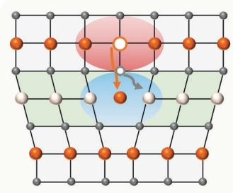  
Lithium heterogeneity-induced formation of dislocation

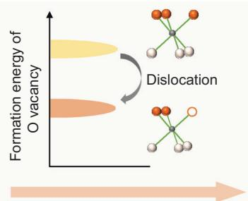  
Lattice strain of dislocation reducing O vacancy formation energy

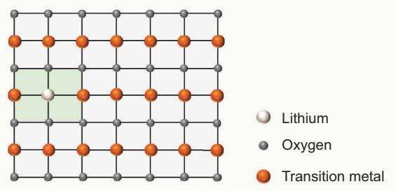  
O vacancy and TM migration-induced formation of spinel and rock-salt phase

b  
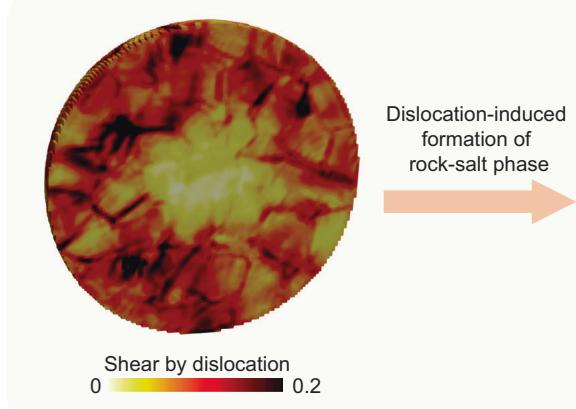  
Dislocation-induced formation of rock-salt phase

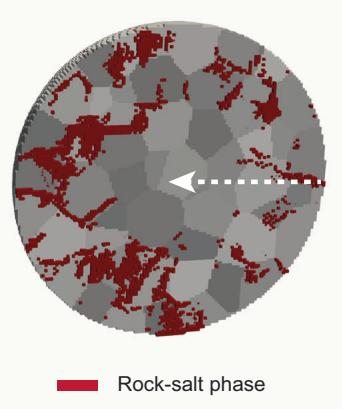

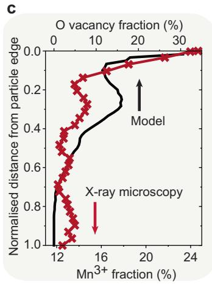

d  
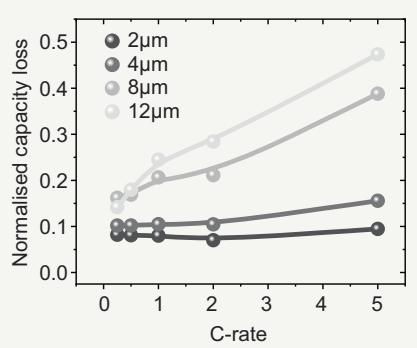

f  
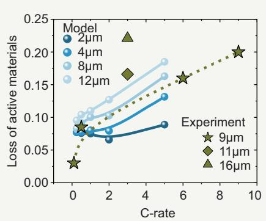

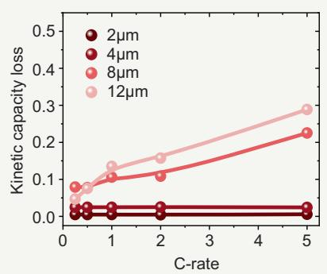  
Fig. 5 | Dislocation-induced structural degradation and capacity loss. a Schematic of dislocation-induced irreversible oxygen release and structura degradation. Dislocations induce large lattice strain can dramatically modify the local oxygen environment, which can markedly impact the structural stability ofthe layered phase and trigger oxygen loss and TM migration. b Distribution of dislocation-induced plastic shear and oxygen-deficient phase. c Comparison of the  
predicted and measured oxygen deficiency5. d Total normalised capacity loss as a function of the particle size and discharge rate. e Effect of particle size and discharge rate on the fraction ofoxygen-deficient phase, compared with experimental characterisation results67–71. f Kinetically induced capacity loss arising from the impediment of Li-ion intercalation pathways.

Figure 5b shows the predicted distribution ofdislocation-induced plastic shear (driven by Li intercalation) in the entire particle after discharge. The inhomogeneous Li concentration distribution and the accumulation of crystal defects significantly affect the structural stability of Ni-rich and Li-rich cathodes, which may ultimately trigger the bulk decomposition ofthese layered phases. The oxidation state maps obtained through X-ray spectromicroscopy and ptychography reveal that oxygen deficiency persists within the bulk of secondary particles, rather than being limited to the near-surface (a few nanometres) region of the particle5. Additionally, these quantitative results show that the arrangement of primary particles within secondary particles results in notable heterogeneity in the extent ofoxygen loss among the primary particles. This observed heterogeneity in oxygen deficiency aligns with the predicted inhomogeneous distribution ofplastic shear induced oxygen loss within the secondary particle, as shown in Fig. 5b. Despite the spatial variation in oxygen deficiency, both experiments5 and predictions depicted in Fig. 5c consistently indicate that, on average, primary particles located near the exterior ofthe agglomerate are more susceptible to oxygen loss compared to those in the interior.

Figure 5e shows the effect of the secondary particle size and discharge rate on the fraction of the oxygen-deficient phase within the secondary particle. The results demonstrate that significant bulk structural degradation occurs in secondary particles larger than \~8 μm when subjected to discharge rates exceeding 1 C, leading to a loss of over 10% of active materials. This emphasises the critical impact of both cathode microstructure and operating conditions on the overall quantity and distribution of the oxygen-deficient phase, a factor that can significantly affect the electrochemical performance of composite cathodes. Figure 5d shows the predicted capacity loss of composite cathodes after accounting for the irreversible oxygen-deficient phase transition in cathodes, as a function of secondary particle size and discharge rate. A noticeable difference in behaviour is observed: particles exceeding 8 μm in diameter exhibit a significant normalised capacity loss, ranging from 0.2 to 0.4, as the discharge rate increases from 1 C to 5 C, while this effect is less pronounced for smaller particles. This phase transition-induced capacity loss is attributed to a combination of factors, including the loss of active materials (thermodynamic effect) and the impediment of Li-ion intercalation pathways within the cathodes (kinetic effect). Furthermore, Fig. 5f shows that secondary particles exceeding 8 μm in diameter and subjected to discharge rates greater than 1 C experience a kinetically induced capacity loss of over 0.1, which is primarily attributed to the accumulation of crystal defects and associated structural degradation at the particle’s periphery.

In addition, Fig. 5e includes the effect of cathode particle size and cycling conditions on the loss of active cathode material from experimental characterisation67–71. It is noteworthy that the experimental analysis of active cathode material loss generally involves the formation of rock-salt phase and isolated cathode materials induced by intergranular fracture67–71. Since this study does not explicitly consider crack formation, only qualitative comparisons are made between predictions and experimental characterisations. Figure 5e shows that the total loss of active cathode material increases with a higher charging rate according to experimental characterisation67–70, which aligns with the predicted results. For example, increasing the charging rate from 0.5 C to 6 C leads to an increase in the loss ofactive material from 8.5% to 16%67–70. Furthermore, experimental characterisation reveals that the capacity fading of cells using small cathode particles (average diameter of 11 μm) can be reduced from 22.1% to 16.6%, compared to those with large cathode particles (16 μm)71. This capacity fading mechanism is generally attributed to the loss ofLi inventory, plating of Li, and loss of active material from both electrodes.

## Preliminary insights and perspectives on model development

The current model simplifies or neglects a few other factors that should be addressed to provide a full description ofchemo-mechanics in solid-state batteries in the future, for example, explicit description of interfacial and intergranular crack formation32–35,38–40,43,44,72, concentration-dependent elastic modulus ofNMC cathodes58–60, plastic deformation in solid electrolytes73–75, role of discrete dislocations and grain boundaries in Li diffusion and chemo-mechanics ofNMC cathodes33,35,76,77, and generation of the representative electrode particle microstructure from microscopy data43,78.

Crack formation in composite cathodes. One ofthe crucial aspects of composite cathodes in solid-state batteries is the stress response of their microstructure to lattice dimension changes induced by Li transport. As shown in Fig. 3, high tensile stresses build up along grain boundaries in cathodes and at the interface between cathodes and solid electrolytes upon electrochemical cycling. This high stress can lead to contact mechanics problems. Loss of interfacial contact within the cell obstructs Li transport in cathodes and charge-transfer reactions at the cathode/electrolyte interface, which subsequently results in resistance increase, capacity loss, and rate performance deterioration in batteries. While this study effectively captures the heterogeneous stress response and crystalline defect formation induced by compositional strains, it does not account for crack formation. Including mechanical fracture in the model would be beneficial to achieve a comprehensive understanding of the mechanical behaviour in solid-state batteries. Particle fracture and interfacial contact loss in electrode materials can be integrated into the chemo-mechanical models using cohesive zone models32–35, spring analogy approaches38,39, continuum-damage models40, and phase-field damage models43,44,72.

Li-concentration-dependent elastic modulus. Nanoindentation mechanical experiments and first-principles calculations reveal that the elastic modulus ofNMC cathodes is highly dependent on the lithiation state58,59, as shown in Figs. 3c and 6a. Full delithiation ofNMC cathodes significantly reduces their elastic mechanical properties58,59. The elastic modulus at fully lithiated and delithiated states thus represents the upper and lower bound for NMC cathodes. Figure 6a, b shows the effect of the elastic modulus ofNMC cathodes on the formation of dislocations and stress distribution at the interface between cathodes and electrolytes, at a discharge rate of 1 C. The reduction in the elastic modulus ofNMC cathodes leads to a decrease of the average dislocation shear from 0.09 to around 0.03 within the cathodes. However, the maximum principal stress distribution at the interface between cathodes and solid electrolytes is minimally impacted by the decrease in the elastic modulus ofNMC. Figure 6b shows that high tensile stress persists at the interface, regardless of whether the elastic modulus corresponds to the fully lithiated or delithiated state.

Elasto-plastic deformation in solid electrolytes. The assessment of the chemo-mechanical behaviour of composite cathodes in this study assumes that the solid electrolyte behaves as an elastic solid, which is valid for oxide electrolytes74,75. However, sulfide electrolytes are expected to undergo plastic deformation in response to the volume change of electrodes due to their low yield strength73–75. For example, indentation measurements indicate that the yield strength for amorphous and crystalline sulfide electrolytes ranges from 200 MPa to 450 MPa, while the yield strength for oxide-based electrolytes is significantly higher, ranging from 2 GPa $\mathbf { t o } 3 \mathbf { G P a } ^ { 7 3 - 7 5 }$ . Figure 6c–f shows the effect of the plastic deformation in oxide and sulfide electrolytes on the chemo-mechanical behaviour of composite cathodes, at a discharge rate of 1 C. Here, solid electrolytes are modelled as isotropic elasto-plastic materials using the isotropicJ plasticity model48, with a yield strength of 2 GPa for oxide electrolytes, 450 MPa for crystalline sulfide electrolytes, and 200 MPa for amorphous sulfide electrolytes73–75. Figure 6c shows that oxide-based electrolytes exhibit minimal plastic deformation upon lithiation of composite cathodes. The impact of plastic deformation in oxide electrolytes on the formation of dislocations in cathodes and interfacial stress distribution is negligible (Fig. 6d). In contrast, Fig. 6e, f shows that while the plastic deformation in sulfide electrolytes does not obviously impact dislocation formation in NMC cathodes, it can effectively reduce the tensile stress concentration at the interface between cathodes and solid electrolytes.

Dislocation-mediated Li diffusion. Bragg coherent diffraction imaging characterisation21,22 and chemo-mechanical phase-field dislocation modelling64,79,80 indicate that discrete dislocations can result in large lattice mismatch and non-uniform stress fields near dislocations in electrode materials. These stress-strain fields around dislocations can potentially alter the overall Li diffusion behaviour and Li concentration distribution64,79,80. For example, chemo-mechanical phasefield simulations have demonstrated that there is strong Li enrichment and depletion in the tensile and compressive stress fields around the dislocation, respectively, in $\mathsf { L i M n } _ { 2 } \mathsf { O } _ { 4 }$ cathodes79. Additionally, pipe diffusion can be initiated on the tensile stress side of edge dislocations79. Moreover, recent advancements in strain engineering have employed dislocations to tune ionic transport properties in Li-ion conducting argyrodites $\mathsf { L i } _ { 6 } \mathsf { P S } _ { 5 } \mathsf { B r } ^ { 8 1 }$ . These findings suggest that inducing internal strain and dislocations in the structure of argyrodites through applying uniaxial and hydrostatic pressures can promote Liion disorder, and lead to higher Li-ion conductivity81. Although the current model in this study does not explicitly describe the effect of self-stress around dislocations on Li-ion transport behaviour in electrodes and solid electrolytes, this effect can be incorporated into the chemo-mechanical model by reformulating the diffusivity tensor as a function of plastic shear.

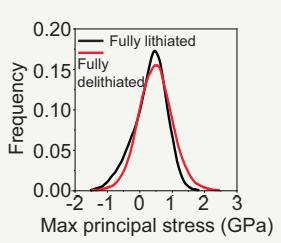

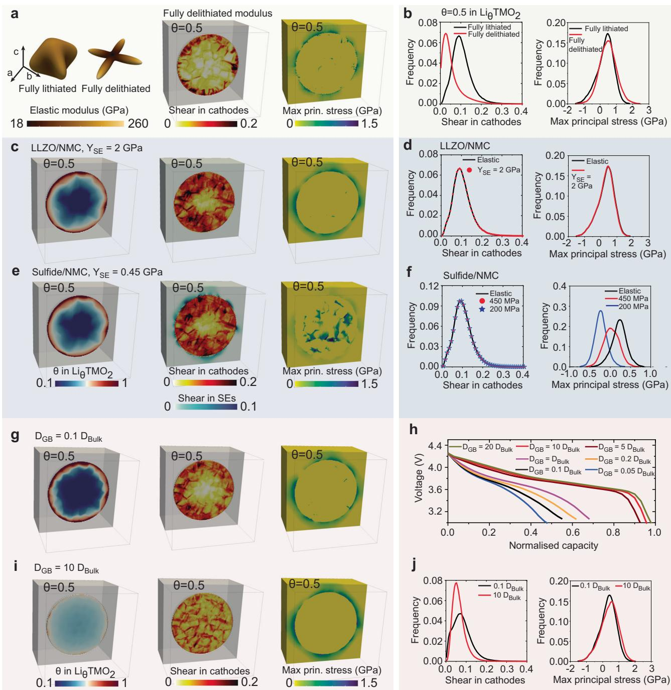

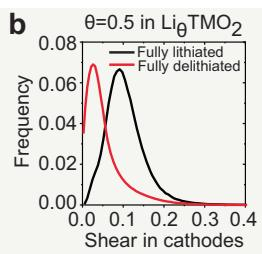

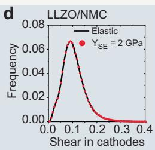

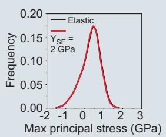

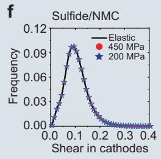

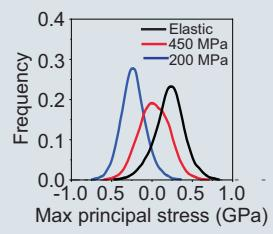

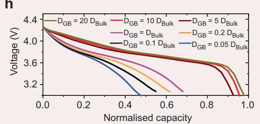  
Fig. 6 | Effect of material properties on the chemo-mechanical behaviour of composite cathodes. a Elastic modulus ofNMC cathodes58–60; distribution of plastic shear and maximum principal stress, using the elastic modulus at the fully delithiated state. b Frequency plots showing the effect of elastic modulus on the shear in cathodes and interfacial maximum principal stress, c. e Distribution of Li concentration, plastic shear, and maximum principal stress, considering the plastic deformation in oxide (c) and sulfide (e) electrolytes. d, f Effect of plastic

Grain boundaries in polycrystalline cathodes. Grain boundaries, with their distinct physicochemical properties compared to the bulk, noticeably affect Li transport, mechanical failure, and structural degradation in polycrystalline NMC cathodes14,20,76,82,83. For example, the low diffusion barriers of TM ions along grain boundaries can promote TM ion dissolution and accelerate formation of rock-salt phases14,20,83. Additionally, the atomistic structures of various grain boundaries, such as local structural distortion and charge redistribu tion, can significantly influence Li transport kinetics76,82. Conductive atomic force microscopy characterisation shows that grain boundaries can generally act as fast pathways for Li transport in $\mathbf { L i C o O } _ { 2 } ^ { 8 2 }$ . Firstprinciples calculations reveal that the coherent Σ2 grain boundaries enhance Li migration both along and across the grain boundary plane, whereas the asymmetric Σ3 grain boundaries substantially impede Li transport in NMC cathodes76. The role of grain boundaries in Li transport kinetics can be incorporated into the chemo-mechanical model by considering the chemical potential or concentration jumps across grain boundaries33,35,77.

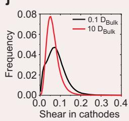

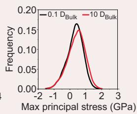  
deformation in oxide (d) and sulfide (f) electrolytes on the shear in cathodes and interfacial maximum principal stress. g. i Distribution of Li concentration, plastic shear, and maximum principal stress, with a tenfold decrease (g) and increase (i) in Li diffusivity along grain boundaries. h Voltage-capacity profiles.j Effect of L transport kinetics along grain boundaries on the shear in cathodes and interfacial maximum principal stress.

In this study, grain boundaries are represented by two layers of elements located between adjacent grains, as shown in Supplementary Fig. S1. Li diffusivity along grain boundaries is assumed to range from 0.05 to 20 times that in the bulk. As shown in Fig. 6g, i, fast Li transport along grain boundaries can significantly enhance the homogeneity of Li distribution within the polycrystalline cathode particle, and effectively decrease the overpotential on the surface of cathodes. Figure 6h shows the voltage-capacity profiles at a discharge rate of 1 C, with various Li transport kinetics along grain boundaries. A fivefold increase in Li diffusivity along grain boundaries results in a 20% increase in capacity, while a corresponding fivefold decrease in Li diffusivity leads to an 8% capacity fade. This indicates that, besides the mechanisms intrinsic to the crystal and electronic structure ofNMC cathodes, tailoring and optimising grain boundary properties in polycrystalline NMC cathodes can significantly enhance their rate capacity. For example, solid-state electrolyte infused along the grain boundaries in Ni-rich NMC particles acts as fast channel for Li transport, which realises an increase in capacity retention from 79% to 91.6% after 200 cycles84. Figure 6g, i, j shows that high tensile stresses exist at the interfaces between cathodes and solid electrolytes regardless of Li transport kinetics along grain boundaries, which is largely determined by anisotropic compositional strains and mechanical properties of composite cathodes.

Constructing microstructure from experimental data. Given the anisotropic electrochemical and mechanical properties ofNMC cathodes, the present study, along with chemo-mechanical fracture simulations43 and experimental characterisation studies51,52, demonstrate that regulating the morphology and crystallographic orientation of primary particles can effectively mitigate crystal defect formation, stress concentration, and microcracking in Ni-rich NMC cathodes. Such regulation can significantly improve the rate and cycling performance of composite cathodes. For example, modifying the surface energies through a boron doping strategy can induce the directional growth of primary particles, resulting in NMC secondary particles with radially aligned primary particles51,52. This unique crystallographic texture allows diffusion channels to penetrate directly from the surface to the centre, significantly improving the Li-ion diffusion coefficient. Moreover, this radial alignment can effectively alleviate the volume-change-induced stress and intergranular fracture in cathodes43,51,52. This representative three-dimensional microstructure for chemo-mechanical modelling can be generated based on multimodal microscopy characterisations78,85,86. Statistical representations of particle microstructures can be derived from X-ray nano-computed tomography data85 and sub-particle grain representations can be derived from electron backscatter diffraction data86.

## Discussion

The pursuit of mitigating capacity loss in Ni-rich oxide cathodes has been a focal point of research, targeting challenges including oxygen loss, structural degradation, and mechanical failure within composite electrodes1–3,6,7,9,12,16. The transition from a layered to rock-salt phase in NMC cathodes is an inevitable result of cationic mixing and oxygen loss87. Among Ni, Co, and Mn ions, Ni ions have the strongest tendency to mix with Li ions, primarily due to the similarity in ionic radius between Ni and Li ions87,88. The onset potential of oxygen loss decreases with increasing Ni content, for example, at around 4.6 V for NMC111 and at 4.2 V for NMC81188,89. Therefore, Ni-rich cathodes undergo severe structural degradation at lower charging voltages. To date, surface coating and modification stand out as the predominant methodologies for curbing undesirable side reactions between oxide cathodes and solid electrolytes13–15. While irreversible surface degradation plays a role in capacity loss, the significant hurdle arises from crystal defect-induced phase transitions from the layered structure to the spinel-like phase within the interior of cathode particles, posing a formidable barrier to the practical implementation of Ni-rich and Lirich cathodes4,5,16,17,30. In light of this, it becomes imperative to explore additional approaches that can complement established surface engineering methods.

Addressing crystal defects and lattice strain challenges in Ni-rich cathodes necessitates a holistic consideration of the heterogeneous cathode microstructure, and large anisotropic volume changes driven by Li transport. This calls for a fundamental consideration of compo sition design and microstructure regulation. Our findings underscore the potential of morphological optimisation and a controlled rate of Li (de)intercalation as chemistry-agnostic strategies to enhance stabilit against oxygen loss. As shown in Fig. 7a, b, reducing the secondar particle diameter to below 4 μm can effectively mitigate the capacit fading issue observed in conventional polycrystalline cathodes71,90 Reducing the diameter ofsecondary particles from 9 μm to below 4 μm enables the increase of the discharge rate from 1 C to 5 C while main taining the same 90% usable capacity. This improvement is attributed to the effective shortening of the Li intercalation path and a reduced accumulation ofcrystalline defects, such as dislocations, during batter operation. TEM analysis further supports these findings, suggesting that reducing the charge rate to below 0.1 C or decreasing the particle size to 1 μm can mitigate structural defects and microcracks, thereb enhancing the cycling stability of Ni-rich NMC cathodes91. Moreover the simulation results presented in Figs. 4d and 7b indicate tha employing single crystal cathodes can significantly reduce the forma tion of dislocations and mitigate oxygen-loss-related structural degra dation in Ni-rich NMC cathodes. Differential electrochemical mas spectroscopy characterisation and HRTEM characterisation also revea that the formation of rock-salt phase in the bulk of cathodes is con siderably reduced in single crystal Ni-rich cathodes, compared to polycrystalline cathodes3,92–96. Therefore, the improved chemomechanical and cycling performance of single crystal NMC cathodes can be attributed to both the elimination of intergranular cracks and the reduction in defects-induced bulk, structural degradation. It is note worthy that, as shown in Fig. 4d, a high discharge rate of 5 C still results in a spatially heterogeneous distribution of Li-ions inside the single crystal cathode particle, which induces a large strain gradient and triggers the accumulation of dislocations at the edges of single crysta particles, despite the absence of intergrain boundaries in these cath odes. As characterised by the multiscale spatial resolution diffractior and imaging experiments97, these structural defects cannot be elimi nated simply with Li-ion deintercalation or reinsertion in NMC singl crystal cathodes. The accumulation of these unrecoverable crystal defects through repeated cycling at high charge rates exacerbate irreversible phase transformation, ultimately leading to the electro chemical decay of single crystal cathodes. To mitigate dislocation for mation, it is crucial to enhance Li-ion diffusion kinetics and suppress heterogeneous electrochemical reactions. This can be accomplished b reducing the size of such single crystal cathodes, regulating the crystal facets to reduce Li-ion diffusion pathways, modifying the crysta structure to minimise Li or Ni antisite disordering, and improving electronic conductivity97.

Figure 7c shows that using a single type of solid electrolytes cannot simultaneously mitigate the large tensile stress buildup in NMC cathodes and on the interfaces between these cathodes and the solid

b

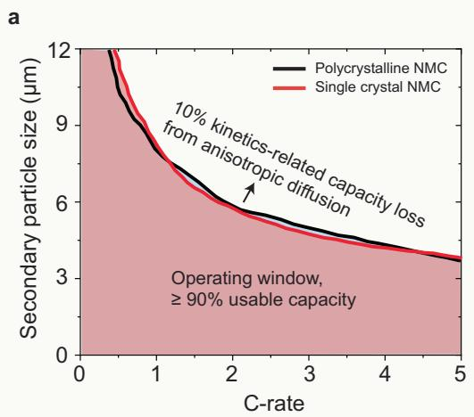

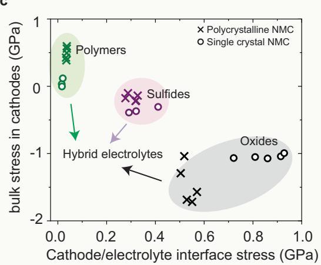  
Fig. 7 | Microstructural effects in solid-state cathode composites. a Contours of kinetically-induced capacity loss of 0.1 due to anisotropic and concentrationdependent diffusion as a function of particle diameter and C-rate. b Contours of 10% loss of active materials induced by the formation of dislocations as a function ofparticle diameter and C-rate. c Relationships between the bulk stress within NMC

electrolytes. This often leads to either the formation of intergranular cracks within the cathodes or contact loss along the cathode/solidelectrolyte interfaces. Therefore, hybrid systems that involve both oxides and polymer electrolytes seem to be a promising solution to address the mechanical degradation issues in solid-state batteries1. Furthermore, preventing cation disordering emerges as a potent means to inhibit the structural changes required to accommodate oxygen vacancies. For instance, the ribbon superstructure, as opposed to the honeycomb superstructure in TM metal layers within sodiumion intercalation cathodes proves capable of suppressing manganese disorder and the associated oxygen molecule formation, during the P2 to O2 phase transition involving slab gliding30,98,99.

The large anisotropic volume changes of Ni-rich cathode materi als during cycling result in mechanical degradation at the cathode/ solid-electrolyte interface, which leads to the increase of electrode impedance and capacity loss100. This phenomenon is compounded by the substantial formation of crystal defects within the cathode particles, to reduce the stress magnitude and accommodate the large compositional strain. First-principle calculations suggest that transition-metal centres with non-bonding electronic configurations, cation disordering, redox-inactive species, isotropic structures, and octahedral-to-tetrahedral migration of Li can effectively minimise volume changes upon (dis)charging101. For instance, the introduction of compositionally complex dopants (Ti, Mg, Nb, and Mo) to Ni-rich layered cathodes or the incorporation of a coherent perovskite phase into the layered structure demonstrates a marked reduction in lattice dimension changes over a wide electrochemical window102,103. This approach effectively mitigates the structural degradation through a pinning effect. Furthermore, eliminating synthesis-induced crystal defects, such as low-angle tilt boundaries, anti-phase boundaries, stacking faults, and dislocations, contributes to superior structural stability at high voltages while preventing irreversible oxygen release92,104.

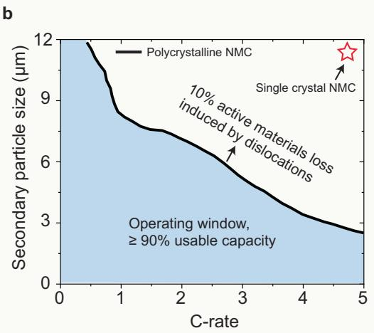

  
cathodes and the interface stress (maximum tensile stress) between cathodes and the solid electrolytes. Different points correspond to the results under various discharge rates from 0.25 C to 5 C. d Schematic view ofdifferent chemo-mechanical degradation mechanisms: kinetically-induced capacity loss; structural degradation induced by dislocations; crack formation and contact loss

In conclusion, our study presents and applies a mesoscale chemomechanical constitutive model for investigating the effect of grainlevel chemo-mechanics on the electrochemical performance and degradation mechanisms in composite cathodes of solid-state batteries. Integrating multi-scale experimental and theoretical findings, we reveal that Ni-rich cathodes experience extensive dislocation formation (over 12% plastic shear locally) during discharge, due to the large compositional strains, crystalline anisotropy, and nonequilibrium Li-ion intercalation dynamics. Anisotropic diffusion within the a-b plane, coupled with the high Li diffusivity sensitivity to Li content, lead to the heterogeneous Li distribution within cathodes, causing a marked increase in overpotential and capacity loss. Accumulated dislocations on the cathode periphery induce large lattice strain and profoundly alter the local oxygen environment, potentially triggering oxygen release and the displacement of TM ions into the alkali metal layers. The formation of crystal defects in the bulk of cathode particles driven by Li intercalation can not be alleviated by the established surface coating and modification approaches. Strategies such as reducing the secondary particle diameter to below 4 μm, using single crystal cathodes without interparticle boundaries, and compositionally complex doping, prove effective in countering the generation of crystal defects and addressing capacity fading in conventional polycrystalline cathodes. The results also imply that contact loss at the cathode/solid-electrolyte interface is intricately linked to the anisotropic volume change during Li (de)intercalation and the mechanical properties of solid electrolytes. Reduction in current densities proves insufficient to alleviate the persistent tensile stress and contact loss at the interface. This work provides insights into the role of crystalline anisotropy and grain-level chemo-mechanics in crystal defect generation and mechanical degradation mechanisms of composite electrodes with Ni-rich cathodes, offering valuable contributions to improving energy storage system design.

## Methods

## Governing equations

The free energy of the NMC811 cathode includes the chemical free energy per unit volume ofa stress-free homogeneous NMC crystal and the mechanical energy,

$$
\psi (c _ {\mathrm{Li}}, \mathbf {F}) = \psi_ {\text { chem }} (c _ {\mathrm{Li}}) + \psi_ {\text { mech }} (c _ {\mathrm{Li}}, \mathbf {F}),\tag{1}
$$

where $\psi _ { \mathrm { c h e m } }$ and $\psi _ { \mathrm { { m e c h } } }$ describe the bulk chemical and mechanical energy density, respectively. The maximum molar density of Li lattice sites is $C _ { \mathrm { m a x } } = 4 9 2 0 0 0 0 0 \mathrm { s m } ^ { - 3 5 6 } . c _ { \mathrm { L } }$ is the molar density ofLi at a spatial position at a given time. The Li occupancy fraction θ can then be calculated as $\theta { = } c _ { \mathrm { L i } } / C _ { \mathrm { m a x } }$ . F is the total deformation gradient.

Li reaction at the cathode/solid-electrolyte interface and diffusion within the cathode is modelled by the Cahn-Hilliard reaction-diffusion equation46,53

$$
\begin{array}{l} \frac {\partial c _ {\mathrm{Li}}}{\partial t} = C _ {\max} \frac {\partial \theta}{\partial t} \\ = - \nabla \cdot \mathbf {j} + R (\theta , \eta), \end{array}\tag{2}
$$

in which t is time, j is the corresponding Li flux density, and R is the reaction rate depending on the local state-of-charge and the overpotential η.

Since the relaxation time for mechanical deformation is fast for solids compared to reaction-diffusion of Li-ion, we assume mechanical equilibrium at all times,

$$
\nabla \cdot \mathbf {P} = \mathbf {0},\tag{3}
$$

where the left-hand side is the divergence of the first Piola-Kirchhoff stress P.

## Reaction-diffusion model

The interface reaction is described by a boundary condition expressing mass conservation on the reactive surfaces,

$$
R = - \mathbf {n} \cdot \mathbf {j} _ {\mathrm{r}},\tag{4}
$$

wherej is the diffusive flux on the surface, and n is the unit normal to the reactive surface. The reaction rate depends on the local state-ofcharge and the local overpotential, which can be described via generalised Butler-Volmer kinetics53. In this study, galvanostatic simulations are performed for a given (dis)charge rate. Consequently, a constant ionic flux is applied normal to the reactive surface of the secondary particle and is directly related to the current density. Then, at a (dis)charge rate of nC, the reaction rate is given by

$$
R = n Q \rho \frac {V _ {\mathrm{NMC}}}{A _ {\mathrm{NMC}}},\tag{5}
$$

where $Q { = } 2 0 3 \mathsf { m A h g ^ { - 1 } }$ and $\rho = 4 . 7 8 \mathrm { g c m } ^ { - 3 }$ are the practical capacity and density of NMC811 cathode56, respectively. VNMC and $A _ { \mathrm { N M C } }$ are volume and surface area of the spherical cathode particle. The voltage of the cathode particle is calculated as the average value over the entire surface of the cathode particle.

The regular solution model is used to model the homogeneous chemical free energy,

$$
\psi_ {\text { chem }} = C _ {\max} \left[ k _ {\mathrm{B}} T (\theta \ln \theta + (1 - \theta) \ln (1 - \theta)) + E _ {1} \theta + E _ {1 1} \theta^ {2} \right]\tag{6}
$$

where $k _ { \mathrm { B } }$ is the universal gas constant, T is temperature, $E _ { 1 }$ and $E _ { \mathrm { { 1 1 } } }$ are material coefficients that can obtained from the open circuit voltage of a NMC half-cell18.

The flux force for Li-ion diffusion is described by

$$
\mathbf {j} = - C _ {\max} \mathbf {M} \cdot \nabla \mu ,\tag{7}
$$

where M is the anisotropic mobility tensor. The magnitude of the mobility tensor M is measured by the solid-state nuclear magnetic resonance spectroscopy experiments18,57. μ is Li chemical potential, which contains the chemical part, μ , and the mechanical part, $\mu _ { \mathrm { m e c h } } .$ . Lithium intercalation in the cathode is driven by the gradient of the Li chemical potential μ. The chemical potential of Li in NMC cathode is defined as the variational derivative of the total free energy to Li concentration,

$$
\begin{array}{r l} \mu & = \frac {\delta \psi}{\delta c _ {\mathrm{Li}}} \\ & = \frac {\delta \psi_ {\mathrm{chem}}}{\delta c _ {\mathrm{Li}}} + \frac {\delta \psi_ {\mathrm{mech}}}{\delta c _ {\mathrm{Li}}} \\ & = \mu_ {\mathrm{chem}} + \mu_ {\mathrm{mech}} \\ & = k _ {\mathrm{B}} T \ln \frac {\theta}{1 - \theta} + E _ {1} + 2 E _ {1 1} \theta + \mu_ {\mathrm{mech}}. \end{array}\tag{8}
$$

The mechanical contribution in Li chemical potential, μ , is described in the following section.

## Mechanical constitutive model

The finite-strain deformation field χ x : x $B _ { 0 } \to { \bf y } \in B$ maps mate rial points x in the reference configuration $\scriptstyle B _ { 0 }$ to points y in its deformed configuration . The total deformation gradient is defined as

$$
\mathbf {F} = \frac {\partial \boldsymbol {\chi}}{\partial \mathbf {x}} = \nabla \boldsymbol {\chi}.\tag{9}
$$

In the current study, the deformation gradient F is multiplicativel decomposed as

$$
\mathbf {F} = \mathbf {F} _ {\mathrm{e}} \mathbf {F} _ {\mathrm{c}} \mathbf {F} _ {\mathrm{p}},\tag{10}
$$

in terms of the elastic strain $\mathbf { F } _ { \mathrm { e } } ,$ dislocation-induced plastic strain $\mathbf { F _ { p } } ,$ and compositional eigenstrain $\mathbf { F _ { c } } ^ { 4 6 , 4 7 , 1 0 5 }$ 5. The compositional eigenstrain $\mathbf { F } _ { \mathrm { c } }$ is Li-ion concentration-dependent and links the relation between the local state-of-charge and lattice mismatch in the a, b and c directions, respectively. The plastic deformation gradient $\mathbf { F _ { p } }$ is incorporated to depict the accumulation of plastic shear arising from a − b plane dislocations within cathodes.

The local deformation arising from Li-ion (de)intercalation is given by

$$
\mathbf {F} _ {\mathrm{c}} = \mathbf {I} + \mathbf {V} _ {\mathrm{c}}.\tag{11}
$$

The components of $\mathbf { v } _ { \mathrm { c } }$ can be expressed as:

$$
\mathbf {V} _ {\mathrm{c}} = \left[ \begin{array}{c c c} \nu^ {\mathrm{a}} & \mathbf {0} & \mathbf {0} \\ \mathbf {0} & \nu^ {\mathrm{b}} & \mathbf {0} \\ \mathbf {0} & \mathbf {0} & \nu^ {\mathrm{c}} \end{array} \right],\tag{12}
$$

in the crystal’s coordinate system. The (de)lithiation strain $\mathbf { F } _ { \mathrm { c } }$ is determined as a function of Li concentration through the experimentally measured lattice parameter changes along different crystallographic directions19.

The evolution of plastic deformation gradient $\mathbf { F _ { p } }$ is given in terms of the plastic velocity gradient $\mathbf { L } _ { \mathrm { p } }$ by the flow rule

$$
\dot {\mathbf {F}} _ {\mathrm{p}} = \mathbf {L} _ {\mathrm{p}} \mathbf {F} _ {\mathrm{p}}.\tag{13}
$$

To describe the dislocation slip on the a−b plane, a crystal plasticity mode $^ { 4 7 , 4 8 , 1 0 5 }$ is used, where the plastic velocity gradient $\mathbf { L } _ { \mathbf { p } }$ consists of the slip rates $\boldsymbol { \dot { \gamma } } ^ { \alpha }$ on crystallographic slip systems,

$$
\mathbf {L} _ {\mathrm{p}} = \sum_ {\alpha} \dot {\gamma} ^ {\alpha} \mathbf {m} ^ {\alpha} \otimes \mathbf {n} ^ {\alpha},\tag{14}
$$

where $\dot { \gamma } ^ { \alpha }$ denotes the shear rate on slip system α, and vectors mα and nα are the slip direction and slip plane normal of slip systems, respectively. The shear rate is given in terms of the phenomenological description as

$$
\dot {\gamma} ^ {\alpha} = \dot {\gamma} _ {0} \left| \frac {\tau^ {\alpha}}{g ^ {\alpha}} \right| ^ {n} \operatorname{sgn} \left(\tau^ {\alpha}\right),\tag{15}
$$

where $\dot { \gamma } _ { 0 }$ is the reference shear rate, $\tau ^ { \alpha }$ is the resolved shear stress on slip system $\alpha , ~ n$ is the strain-rate sensitivity exponent. The slip resistance $g ^ { \alpha }$ evolves from its initial value $( g _ { 0 } )$ asymptotically to a system-dependent saturation value $g _ { \infty }$ and depends on shear on slip systems (γβ, β = 1, 2, 3) according to the relationship

$$
\dot {g} ^ {\alpha} = \dot {\gamma} ^ {\beta} h _ {0} | 1 - g ^ {\beta} / g _ {\infty} | ^ {a} \operatorname{sgn} \left(1 - g ^ {\beta} / g _ {\infty}\right) h _ {\alpha \beta},\tag{16}
$$

with hardening parameters $h _ { 0 } ,$ a, and $h _ { \alpha \beta } .$

The mechanical energy density, ψ , is modelled by the following form

$$
\psi_ {\text { mech }} = \frac {1}{2} \mathbf {E} _ {\mathrm{e}} \cdot \mathbb {C} \mathbf {E} _ {\mathrm{e}},\tag{17}
$$

where $\mathbb { C }$ is the anisotropic elastic stiffness. $\mathbf { E } _ { \mathrm { e } }$ is the Green-Lagrange strain, which is calculated as

$$
\mathbf {E} _ {\mathrm{e}} = \frac {1}{2} \mathbf {F} _ {\mathrm{c}} ^ {\mathrm{T}} \left(\mathbf {F} _ {\mathrm{e}} ^ {\mathrm{T}} \mathbf {F} _ {\mathrm{e}} - \mathbf {I}\right) \mathbf {F} _ {\mathrm{c}},\tag{18}
$$

The work conjugate second Piola-Kirchhoff stress S is given by,

$$
\mathbf {S} = \mathbb {C} \mathbf {E} _ {\mathrm{e}},\tag{19}
$$

which is related to the first Piola-Kirchhoff stress P through

$$
\mathbf {P} = \mathbf {F} _ {\mathrm{e}} \mathbf {F} _ {\mathrm{c}} \mathbf {S} \mathbf {F} _ {\mathrm{p}} ^ {- T}.\tag{20}
$$

Combination of Eqs. (10), (11), and (17) to (20) then yield the mechanical contribution for the Li chemical potential in Eq. (8) as

$$
\begin{array}{r l} \mu_ {\mathrm{mech}} & = \frac {\delta \psi_ {\mathrm{mech}}}{\delta c _ {\mathrm{Li}}} \\ & = - \frac {1}{C _ {\max}} \mathbf {F} _ {\mathrm{c}} \mathbf {S} \cdot \frac {\partial \mathbf {V} _ {\mathrm{c}}}{\partial \theta}. \end{array}\tag{21}
$$

## Oxygen vacancy formation energy

The formation ofcrystal defects, such as dislocations, not only leads to large lattice strain but also dramatically modifies the local oxygen environment, which manifests through inserting extra lattice planes or perturbing the sequence of oxygen layers4,5,21,22. The role of lattice strain arsing from dislocations in the formation energy of oxygen vacancies in the layered oxide structure is assessed via atomic-scale calculations4,22,28,29. The formation energy of oxygen vacancy $( E _ { 0 } )$ is given by the following equation:

$$
E _ {0} [ \mathrm{V} _ {0} ] = E _ {\text { total }} [ \mathrm{V} _ {0} ] - E _ {\text { total }} [ \mathrm{P} ] + \mu_ {0},\tag{22}
$$

where $E _ { \mathrm { t o t a l } } [ \mathrm { V } _ { \mathrm { O } } ]$ and $E _ { \mathrm { t o t a l } } [ \mathsf { P } ]$ denote the total energy of the supercells with and without an oxygen vacancy, respectively. $\mu _ { 0 }$ is the chemical potential of oxygen, where the gas phase ${ \bf O } _ { 2 }$ molecule is used as the reference state. The details of these first principle calculations can be found in the references4,22,28,29. Supplementary Fig. S3 shows the influence of the applied tensile strain on the formation energy of oxygen vacancy in the layered oxide structure. The results indicate that the increased lattice strain notably decreases the energy barrier to remove lattice oxygen4. To account for the impact of dislocationinduced shear during Li (de)intercalation on oxygen release in our mesoscale chemo-mechanical simulations, the material domains with a plastic shear exceeding 12% are delineated as the oxygendeficient phase.

## Numerical implementation

The developed chemo-mechanical model was implemented in the freeware simulation package DAMASK, specifically in DAMASK v2.0.2 version48. A large-scale parallel finite element solver using the PETSc numerical library45 was developed to handle the discretization and numerical solution of the coupled governing equations46,47.

The weak form ofthe linear momentum balance equation, Eq. (3), is given by

$$
\mathbf {0} = \int_ {\mathcal {B} _ {0}} \nabla \delta \boldsymbol {\chi} \cdot \mathbf {P} d \mathbf {x},\tag{23}
$$

where $\delta \pmb { \chi }$ is the admissible variation of the deformation field $\pmb { \chi } .$ The deformation gradient partitioning (Eq. (10)) and the stresses (Eq. (19)) are calculated based on a two-level iterative predictor-corrector scheme, as described in detail in Shanthraj et al.72.

The weak form of the reaction-transport relation, Eq. (2), is given by

$$
\int_ {\mathcal {B} _ {0}} \left[ \left(\dot {\theta} - \frac {1}{C _ {\max}} R\right) \delta \mu + M \nabla \mu \cdot \nabla \delta \mu \right] d x = 0,\tag{24}
$$

where $\delta \mu$ is the virtual chemical potential. It is worth noting that Eq. (2) is reformulated as a function of chemical potential rather than the composition as the independent field variable, using a semi-analytical inversion approach46,106,107.

The deformation field, χ(x), and chemical potential, μ(x), in addition to their virtual counterparts are discretised using a finite element basis of shape functions, $\bar { N } _ { i } ^ { \chi } , \bar { N } _ { i } ^ { \mu } , \bar { N } _ { i } ^ { \delta \chi }$ , and $N _ { i } ^ { \delta \mu }$ , where [χ] , [μ] , $[ \delta \pmb { \chi } ] _ { i } ,$ and $[ \delta \mu ] _ { i }$ are the degrees of freedom, respectively. The corresponding discrete differential operator matrices are $\pmb { { \cal B } } _ { i } ^ { \chi } , \pmb { { \cal B } } _ { i } ^ { \mu } , \pmb { { \cal B } } _ { i } ^ { \delta \pmb { \chi } }$ , and $\bar { \pmb { B } _ { i } ^ { \delta \mu } }$ . The weak forms of Eqs. (23) and (24) are reformulated as

$$
\sum_ {i} [ \delta \pmb {\chi} ] _ {i} ^ {T} \int_ {\mathcal {B} _ {0}} \left[ \pmb {B} _ {i} ^ {\delta \pmb {\chi}} \right] ^ {T} \mathbf {P} \textbf {d} \mathbf {x} = \sum_ {\mathrm{i}} [ \delta \pmb {\chi} ] _ {\mathrm{i}} ^ {\mathrm{T}} \mathcal {R} _ {\mathrm{i}} ^ {\mathrm{mech}} = \mathbf {0},\tag{25}
$$

$$
\begin{array}{l} \sum_ {i} [ \delta \mu ] _ {i} ^ {T} \int_ {\mathcal {E} _ {0}} \left[ \left[ N _ {i} ^ {\delta \mu} \right] ^ {T} \left(\dot {\theta} - \frac {1}{C _ {\max}} R\right) + \left[ \boldsymbol {B} _ {i} ^ {\delta \mu} \right] ^ {T} M \boldsymbol {B} _ {i} ^ {\mu} [ \mu ] _ {i} \right] d x \\ = \sum_ {i} [ \delta \mu ] _ {i} ^ {T} \mathcal {R} _ {i} ^ {\text { chem }} = 0, \end{array}\tag{26}
$$

where $\mathcal { R } _ { i } ^ { \mathrm { m e c h } }$ and $\mathcal { R } _ { i } ^ { \mathrm { c h e m } }$ are the residual values at node i of the respective fields. A time-discrete system of equations is obtained by using a backward Euler approximation method

$$
\dot {\theta} = \frac {\theta (t _ {n}) - \theta (t _ {n - 1})}{\Delta t}.\tag{27}
$$

The self-consistent solution of the coupled fields of Eqs. (25) and (26) are achieved using a staggered iteration method for each time increment. This staggered iteration method allows the solution scheme of each field to be prescribed independently. The mechanical equilibrium equation, Eq. (25), is solved using an inexact Newton method with a critical point secant line search108. For the reactiondiffusion equation, Eq. (26), the Newton method with a backtracking line search109 is employed. Within each Newton iteration for both equations, a flexible GMRES linear solver110 preconditioned with a smoothed-aggregation algebraic multigrid method111 is employed for the linear solve. The numerical solution procedure is described in detail in Liu et al.47 and Shanthraj et al.46.

## Model parametrization

Chemical free energy. The homogeneous chemical free energy can be obtained by integrating the homogeneous Li chemical potential, μ , in the NMC811 cathode, which can be measured by the open circuit voltage of a NMC811 half-cell18,57 according to

$$
\mu_ {\mathrm{chem}} = - V _ {\mathrm{OC}} F + \mu_ {\mathrm{Li}} ^ {\mathrm{a}},\tag{28}
$$

where $V _ { \mathrm { O C } }$ is the open circuit voltage, and F is the Faraday constant. $\mu _ { \mathrm { L i } } ^ { \mathrm { a } }$ denotes the chemical potential of Li metal in the anode. The reference chemical potential $\mu _ { \mathrm { L i } } ^ { \mathrm { a } }$ is a constant since the occupancy of Li in the metal anode is invariant. The open circuit voltage versus Li occupancy profile is measured by the galvanostatic intermittent titration technique (GITT) experiment18. The GITT experiment is performed on a cell with an NMC811 cathode and Li metal anode. Therefore, as shown in Supplementary Fig. S2, the chemical-free energy landscape can be extracted by fitting the stress-free chemical potential of Li in cathode with the measured open circuit voltage (Supplementary Table $S 1 ) ^ { 1 8 }$

Diffusivity. The anisotropic mobility tensor M is related to the diffusivity tensor D via the Einstein relation

$$
\mathbf {M} = \frac {\mathbf {D}}{k _ {B} T}.\tag{29}
$$

The layered structure of the NMC cathode restricts Li diffusion solely to the basal plane. The anisotropic diffusivity tensor in the crystallographic coordinate system is given by

$$
\mathbf {D} = \left[ \begin{array}{c c c} D _ {\mathrm{Li}} & 0 & 0 \\ 0 & D _ {\mathrm{Li}} & 0 \\ 0 & 0 & 0 \end{array} \right],\tag{30}
$$

where $D _ { \mathrm { { L i } } }$ is the Li concentration-dependent diffusivity within the basal plane. The diffusion coefficient $D _ { \mathrm { { L i } } }$ is obtained from the Li concentration-dependent hop rate of Li ions in NMC by the solidstate nuclear magnetic resonance spectroscopy experiments18,57. As shown in Fig. 3a, a smooth interpolation function $D _ { \mathrm { L i } } ( \theta )$ is used to fit the measured diffusivity data points from the NMR experiments (Supplementary Table S1),

$$
D _ {\mathrm{Li}} (\theta) = D _ {\text { ref }} \exp \left(D _ {0} + D _ {1} \theta + D _ {2} \theta^ {2} + D _ {3} \theta^ {3} + D _ {4} \theta^ {4} + D _ {5} \theta^ {5}\right).\tag{31}
$$

Lattice dimension change. The (de)lithiation of NMC811 cathode materials leads to a dilatation and distortion of their atomic structures. The atomic lattice dimension change during charge and discharge is measured by operando synchrotron XRD experiments8,18,19. Figure 3b shows the evolution of the lattice strain in the c and a direction of the NMC811 cathode obtained from XRD experiments18. The symmetry of the layered oxide crystal structure indicates that the cathode exhibits the same lattice strain in the a and b direction. The a and b lattice parameters increase upon lithiation by maximum 2%. The c lattice parameter exhibits a nonmonotonic behaviour that it rapidly increases at the initial stage of discharge and gradually collapses as $\theta > 0 . 3 7$ . These dimensional changes are attributed to the change of Ni oxidation states, and the modification of the interlayer spacing between the $0 ^ { 2 ^ { - } }$ planes. Two smooth interpolation functions $\nu ^ { a , b } ( \theta )$ and $\nu ^ { c } ( \theta )$ are employed to fit the experimentally measured lattice dimension changes during lithiation (Supplementary Table S1),

$$
\nu^ {\mathrm{a,b}} (\theta) = \nu_ {0} ^ {\mathrm{a,b}} + \nu_ {1} ^ {\mathrm{a,b}} \theta + \nu_ {2} ^ {\mathrm{a,b}} c \theta^ {2} + \nu_ {3} ^ {\mathrm{a,b}} \theta^ {3} + \nu_ {4} ^ {\mathrm{a,b}} \theta^ {4} + \nu_ {5} ^ {\mathrm{a,b}} \theta^ {5},\tag{32}
$$

and

$$
\nu^ {\mathrm{c}} (\pmb {\theta}) = \nu_ {0} ^ {\mathrm{c}} + \nu_ {1} ^ {\mathrm{c}} \pmb {\theta} + \nu_ {2} ^ {\mathrm{c}} \pmb {\theta} ^ {2} + \nu_ {3} ^ {\mathrm{c}} \pmb {\theta} ^ {3} + \nu_ {4} ^ {\mathrm{c}} \pmb {\theta} ^ {4}.\tag{33}
$$

Elasto-plastic properties. The anisotropic stiffness matrix of the NMC811 cathodes at the fully lithiated and delithiated state is obtained using environmental nanoindentation experiments and first-principles calculations58–60. The observed anisotropic elastic behaviour in layered oxide materials is attributed to the weak bonding along the c axis compared to the a axis58,59. The slip strength along the basal plane ofNMC811 cathode materials is assessed by an indentation-based test method112. Isotropic elastic and elasto-plastic mechanical properties are assumed for solid electrolytes within the composite 73–75,113–116

All the material parameters are summarised in the Supplementary Table S1.

## Data availability

All data to evaluate the conclusions are present in the manuscript, and the Supplementary Material. Raw data are available from the corresponding authors on request.

## Code availability

The open-source code for DAMASK v2.0.2 version is available at https://github.com/damask-multiphysics/DAMASK/tree/v2.0.2. The specific code used in this study can be accessed at https://git.damask-multiphysics.org (branch: plasticity\_chemo\_mechanics, commit: a987e05f8241fb1ef7d8ff913769ea09ac2cd1a3) with the permission of Max-Planck-Institut für Eisenforschung GmbH. Access to the repository requires registration via email at damask-CLA@mpie.de and approval of the Contributor Licence Agreement, available at https://damask-multiphysics.org/\_static/DAMASK\_CLA.pdf.

## References

1. Janek, J. & Zeier, W. G. Challenges in speeding up solid-state battery development. Nat. Energy 8, 230–240 (2023).

2. Kalnaus, S., Dudney, N. J., Westover, A. S., Herbert, E. & Hackney, S. Solid-state batteries: the critical role of mechanics. Science 381, 5998 (2023).

3. Bartsch, T. et al. Gas evolution in all-solid-state battery cells. ACS Energy Lett. 3, 2539–2543 (2018).

4. Liu, T. et al. Origin of structural degradation in Li-rich layered oxide cathode. Nature 606, 305–312 (2022).

5. Csernica, P. M. et al. Persistent and partially mobile oxygen vacancies in Li-rich layered oxides. Nat. Energy 6, 642–652 (2021).

6. Bi, Y. et al. Reversible planar gliding and microcracking in a singlecrystalline Ni-rich cathode. Science 370, 1313–1317 (2020).

7. Koerver, R. et al. Capacity fade in solid-state batteries: interphase formation and chemomechanical processes in nickel-rich layered oxide cathodes and lithium thiophosphate solid electrolytes. Chem. Mater. 29, 5574–5582 (2017).

8. Xu, C. et al. Bulk fatigue induced by surface reconstruction in layered Ni-rich cathodes for Li-ion batteries. Nat. Mater. 20, 84–92 (2021).

9. Banerjee, A., Wang, X., Fang, C., Wu, E. A. & Meng, Y. S. Interfaces and interphases in all-solid-state batteries with inorganic solid electrolytes. Chem. Rev. 120, 6878–6933 (2020).

10. Koerver, R. et al. Redox-active cathode interphases in solid-state batteries. J. Mater. Chem. A 5, 22750–22760 (2017).

11. Shin, H.-J. et al. New consideration of degradation accelerating of all-solid-state batteries under a low-pressure condition. Adv. Energy Mater. 13, 2301220 (2023).

12. Dong, Y. & Li, J. Oxide cathodes: functions, instabilities, self healing, and degradation mitigations. Chem. Rev. 123, 811–833 (2022).

13. Culver, S. P., Koerver, R., Zeier, W. G. & Janek, J. On the functionality of coatings for cathode active materials in thiophosphatebased all-solid-state batteries. Adv. Energy Mater. 9, 1900626 (2019).

14. Liang, J. et al. A gradient oxy-thiophosphate-coated Ni-rich layered oxide cathode for stable all-solid-state Li-ion batteries. Nat. Commun. 14, 146 (2023).

15. Wan, H., Wang, Z., Zhang, W., He, X., Wang, C. Interface design for all-solid-state lithium batteries. Nature 623, 739–744 (2023).

16. Zhang, H., Liu, H., Piper, L. F., Whittingham, M. S. & Zhou, G. Oxygen loss in layered oxide cathodes for Li-ion batteries: mechanisms, effects, and mitigation. Chem. Rev. 122, 5641–5681 (2022).

17. Wang, Z. et al. Reviving the rock-salt phases in Ni-rich layered cathodes by mechano-electrochemistry in all-solid-state batteries. Nano Energy 105, 108016 (2023).

18. Marker, K., Reeves, P. J., Xu, C., Griffith, K. J. & Grey, C. P. Evolution of structure and lithium dynamics in LiNi Mn Co O (NMC811) cathodes during electrochemical cycling. Chem. Mater. 31, 2545–2554 (2019).

19. Xu, C., Reeves, P. J., Jacquet, Q. & Grey, C. P. Phase behavior during electrochemical cycling of Ni-rich cathode materials for Liion batteries. Adv. Energy Mater. 11, 2003404 (2021).

20. Li, S. et al. Direct observation of defect-aided structural evolution in a nickel-rich layered cathode. Angew. Chem. Int. Ed. 59, 22092–22099 (2020).

21. Ulvestad, A. et al. Topological defect dynamics in operando bat tery nanoparticles. Science 348, 1344–1347 (2015).

22. Singer, A. et al. Nucleation of dislocations and their dynamics in layered oxide cathode materials during battery charging. Nat. Energy 3, 641–647 (2018).

23. Gorobtsov, O.Y. et al. Operando interaction and transformation of metastable defects in layered oxides for Na-ion batteries. Adv. Energy Mater. 13, 2203654 (2023)

24. Han, M. et al. Stacking faults hinder lithium insertion in Li RuO . Adv. Energy Mater. 10, 2002631 (2020).

25. Xu, Z. et al. Charging reactions promoted by geometrically necessary dislocations in battery materials revealed by in situ single-particle synchrotron measurements. Adv. Mater. 32, 2003417 (2020).

26. Gong, Y. et al. Three-dimensional atomic-scale observation of structural evolution of cathode material in a working all-solid-state battery. Nat. Commun. 9, 3341 (2018).

27. Yan, P. et al. Coupling of electrochemically triggered thermal and mechanical effects to aggravate failure in a layered cathode. Nat. Commun. 9, 2437 (2018).

28. Li, Q. et al. Dynamic imaging of crystalline defects in lithiummanganese oxide electrodes during electrochemical activation to high voltage. Nat. Commun. 10, 1692 (2019).

29. Song, J.-H. et al. Slab gliding, a hidden factor that induces irreversibility and redox asymmetry of lithium-rich layered oxide cathodes. Nat. Commun. 14, 4149 (2023).

30. House, R. A. et al. First-cycle voltage hysteresis in Li-rich 3d cathodes associated with molecular O trapped in the bulk. Nat. Energy 5, 777–785 (2020).

31. Ahmed, S. et al. Understanding the formation of antiphase boundaries in layered oxide cathode materials and their evolution upon electrochemical cycling. Matter 4, 3953–3966 (2021).

32. Xu, R. et al. Heterogeneous damage in Li-ion batteries: experimental analysis and theoretical modeling. J. Mech. Phys. Solids 129, 160–183 (2019).

33. Bai, Y., Zhao, K., Liu, Y., Stein, P. & Xu, B.-X. A chemo-mechanical grain boundary model and its application to understand the damage of Li-ion battery materials. Scr. Mater. 183, 45–490 (2020).

34. Taghikhani, K., Weddle, P. J., Hoffman, R. M., Berger, J. & Kee, R. J. Electro-chemo-mechanical finite-element model of single-crystal and polycrystalline NMC cathode particles embedded in an argyrodite solid electrolyte. Electrochim. Acta 460, 142585 (2023).

35. Singh, A. & Pal, S. Coupled chemo-mechanical modeling of fracture in polycrystalline cathode for lithium-ion battery. Int. J. Plast. 127, 102636 (2020).

36. Rezaei, S., Asheri, A. & Xu, B.-X. A consistent framework for chemo-mechanical cohesive fracture and its application in solid state batteries. J. Mech. Phys. Solids 157, 104612 (2021).

37. Han, J., Sharma, N. & Zhao, K. Computational modeling of coupled mechanical damage and electrochemistry in ternary oxide composite electrodes. J. Power Sources 595, 234034 (2024).

38. Taghikhani, K., Weddle, P. J., Berger, J. & Kee, R. J. Modeling coupled chemo-mechanical behavior of randomly oriented NMC811 polycrystalline Li-ion battery cathodes. J. Electrochem. Soc. , 080511 (2021).

39. Barai, P. Computational elucidation of mechanical degradation in NMC cathodes: impact on cell performance. J. Electrochem. Energy Convers. Storage 19, 041007 (2022).

40. Allen, J. M. et al. Quantifying the influence of charge rate and cathode-particle architectures on degradation of Li-ion cells through 3D continuum-level damage models. J. Power Sources 512, 230415 (2021).

41. Chen, W.-X. et al. Cohesive phase-field chemo-mechanical simulations of inter-and trans-granular fractures in polycrystalline NMC cathodes via image-based 3D reconstruction. J. Power Sources 596, 234054 (2024).

42. Singh, A. & Pal, S. Chemo-mechanical modeling of inter-and intragranular fracture in heterogeneous cathode with polycrystalline particles for lithium-ion battery. J. Mech. Phys. Solids 163, 104839 (2022).

43. Singh, A. et al. Microstructure-chemomechanics relations of polycrystalline cathodes in solid-state batteries. Extreme Mech. Lett. 69, 102164 (2024)

44. Huo, H. et al. Chemo-mechanical failure mechanisms of the silicon anode in solid-state batteries. Nat. Mater. 23, 543–551 (2024)

45. Balay, S. et al. PETSc web page. https://petsc.org/ (2024).

46. Shanthraj, P., Liu, C., Akbarian, A., Svendsen, B. & Raabe, D. Multicomponent chemo-mechanics based on transport relations fo the chemical potential. Comput. Methods Appl. Mech. Eng. 365, 113029 (2020).

47. Liu, C. et al. An integrated crystal plasticity–phase field model for spatially resolved twin nucleation, propagation, and growth in hexagonal materials. Int. J. Plast. 106, 203–227 (2018).

48. Roters, F. et al. DAMASK–the Düsseldorf advanced material simulation kit for modeling multi-physics crystal plasticity, thermal, and damage phenomena from the single crystal up to the component scale. Comput. Mater. Sci. 158, 420–478 (2019).

49. Wang, L. et al. Grain morphology and microstructure control in high-stable Ni-rich layered oxide cathodes. Adv. Funct. Mater. 33, 2212849 (2023).

50. Quinn, A. et al. Electron backscatter diffraction for investigating lithium-ion electrode particle architectures. Cell Rep. Phys. Sci. 1, 100137 (2020)

51. Xu, X. et al. Radially oriented single-crystal primary nanosheets enable ultrahigh rate and cycling properties of LiNi Co Mn O cathode material for lithium-ion batteries. Adv. Energy Mater. 9, 1803963 (2019).

52. Park, K.-J. et al. Improved cycling stability of Li [Ni Co Mn ] O through microstructure modification by boron doping for Li-ion batteries. Adv. Energy Mater. 8, 1801202 (2018).

53. Bazant, M. Z. Theory of chemical kinetics and charge transfer based on nonequilibrium thermodynamics. Acc. Chem. Res. 46, 1144–1160 (2013).

54. Zhao, H. et al. Learning heterogeneous reaction kinetics from X-ray videos pixel by pixel. Nature 621, 289–294 (2023).

55. Roters, F. et al. Overview of constitutive laws, kinematics, homogenization and multiscale methods in crystal plasticity finiteelement modeling: theory, experiments, applications. Acta Mater. 58, 1152–1211 (2010).

56. Thapaliya, B. P. et al. Enhancing cycling stability and capacity retention of NMC811 cathodes by reengineering interfaces via electrochemical fluorination. Adv. Mater. Interfaces 9, 2200035 (2022).

57. Xu, C. et al. Operando visualization of kinetically induced lithium heterogeneities in single-particle layered Ni-rich cathodes. Joule 6, 2535–2546 (2022).

58. Xu, R., Sun, H., Vasconcelos, L. S. & Zhao, K. Mechanical and structural degradation of LiNi Mn Co O cathode in Li-ion batteries: an experimental study. J. Electrochem. Soc. 164, 3333 (2017).

59. Lim, J.-M., Kim, H., Cho, K. & Cho, M. Fundamental mechanisms of fracture and its suppression in Ni-rich layered cathodes: Mechanics-based multiscale approaches. Extrem. Mech. Lett. 22, 98–105 (2018).

60. Sharma, N. et al. Nanoindentation measurements of anisotropic mechanical properties of single crystalline NMC cathodes for Liion batteries. Extrem. Mech. Lett. 58, 101920 (2023).

61. Merryweather, A. J., Schnedermann, C., Jacquet, Q., Grey, C. P. & Rao, A. Operando optical tracking of single-particle ion dynamics in batteries. Nature 594, 522–528 (2021).

62. Tan, D. H. et al. Carbon-free high-loading silicon anodes enabled by sulfide solid electrolytes. Science 373, 1494–1499 (2021).

63. Esmizadeh, S. & Haftbaradaran, H. An energy-based stability analysis of misfit dislocations in two-phase electrode particles: a planar model and implications for LiFePO . Int. J. Mech. Sci. 183, 105812 (2020).

64. Zhou, X., Reimuth, C. & Xu, B.-X. Phase-field simulation of misfit dislocations in two-phase electrode particles: driving force calculation and stability analysis. Int. J. Solids Struct. 249, 111688 (2022).

65. Luo, Y. et al. Effect of crystallite geometries on electrochemical performance of porous intercalation electrodes by multiscale operando investigation. Nat. Mater. 21, 217–227 (2022).

66. Sadowski, M., Koch, L., Albe, K. & Sicolo, S. Planar gliding and vacancy condensation: the role of dislocations in the chemomechanical degradation of layered transition-metal oxides. Chem. Mater. 35, 584–594 (2022).

67. Tanim, T. R. et al. Extreme fast charge challenges for lithium-ion battery: variability and positive electrode issues. J. Electrochem. Soc. 166, 1926 (2019).

68. Chinnam, P. R. et al. Fast-charging aging considerations: incorporation and alignment of cell design and material degradation pathways. ACS Appl. Energy Mater. 4, 9133–9143 (2021).

69. Strehle, B., Friedrich, F. & Gasteiger, H. A. A comparative study of structural changes during long-term cycling of NCM-811 at ambient and elevated temperatures. J. Electrochem. Soc. 168, 050512 (2021).

70. Zhang, H., Omenya, F., Whittingham, M. S., Wang, C. & Zhou, G. Formation of an anti-core–shell structure in layered oxide cath odes for Li-ion batteries. ACS Energy Lett. 2, 2598–2606 (2017).

71. Song, Y. et al. Probing the particle size dependence of nonhomogeneous degradation in nickel-rich cathodes for highenergy lithium-ion batteries. Etransportation 16, 100223 (2023).

72. Shanthraj, P., Svendsen, B., Sharma, L., Roters, F. & Raabe, D. Elasto-viscoplastic phase field modelling of anisotropic cleavage fracture. J. Mech. Phys. Solids 99, 19–34 (2017).

73. McGrogan, F.P. et al. Compliant yet brittle mechanical behavior of Li S-P S lithium-ion-conducting solid electrolyte. Adv. Energy Mater. 7, 1602011 (2017).

74. Papakyriakou, M. et al. Mechanical behavior of inorganic lithiumconducting solid electrolytes. J. Power Sources 516, 230672 (2021).

75. Athanasiou, C.E. et al. Rate-dependent deformation of amorphous sulfide glass electrolytes for solid-state batteries. Cell Rep. Phys. Sci. 3, 100845 (2022).

76. He, X., Sun, H., Ding, X. & Zhao, K. Grain boundaries and their impact on Li kinetics in layered-oxide cathodes for Li-ion batteries. J. Phys. Chem. C. 125, 10284–10294 (2021).

77. Zhao, Y. et al. Modeling of phase separation across interconnected electrode particles in lithium-ion batteries. RSC Adv. 7, 41254–41264 (2017).

78. Furat, O. et al. Artificial generation of representative single Li-ion electrode particle architectures from microscopy data. npj Com put. Mater. 7, 105 (2021).

79. Reimuth, C. et al. Chemo-mechanical study of dislocation mediated ion diffusion in lithium-ion battery materials. J. Appl. Phys. 130.035103.(2021)

80. Chen, H., Kim, S. & Huang, H.-Y. S. Exploration of the dislocationelectrochemistry relation in LiFePO cathode materials. Acta Mater. 237, 118158 (2022).

81. Faka, V. et al. Pressure-induced dislocations and their influence on ionic transport in Li+-conducting argyrodites. J. Am. Chem. Soc. 146, 1710–1721 (2024).

82. Zhu, X. et al. Direct observation of lithium-ion transport under an electrical field in ${ \mathsf { L i } } _ { x } { \mathsf { C o O } } _ { 2 }$ nanograins. Sci. Rep. 3, 1084 (2013).

83. Sharifi-Asl, S. et al. Revealing grain-boundary-induced degradation mechanisms in Li-rich cathode materials. Nano Lett. 20, 1208–1217 (2019).

84. Yan, P. et al. Tailoring grain boundary structures and chemistry of Ni-rich layered cathodes for enhanced cycle stability of lithium-ion batteries. Nat. energy 3, 600–605 (2018).

85. Usseglio-Viretta, F. L. et al. Resolving the discrepancy in tortuosity factor estimation for Li-ion battery electrodes through micromacro modeling and experiment. J. Electrochem. Soc. 165, 3403–3426 (2018).

86. Furat, O. et al. Mapping the architecture of single lithium ion electrode particles in 3D, using electron backscatter diffraction and machine learning segmentation. J. Power Sources 483, 229148 (2021).

87. Zhang, S. S. Problems and their origins of Ni-rich layered oxide cathode materials. Energy Storage Mater. 24, 247–254 (2020).

88. Zhang, S. S. Understanding of performance degradation of LiNi Co Mn O cathode material operating at high poten tials. J. Energy Chem. 41, 135–141 (2020).

89. Jung, R., Metzger, M., Maglia, F., Stinner, C. & Gasteiger, H. A. Oxygen release and its effect on the cycling stability of LiNi Mn Co O (NMC) cathode materials for Li-ion batteries. J. Electrochem. Soc. 164, 1361 (2017).

90. Strauss, F. et al. Impact of cathode material particle size on the capacity of bulk-type all-solid-state batteries. ACS Energy Lett. 3, 992–996 (2018).

91. Han, G.-M., Kim, Y.-S., Ryu, H.-H., Sun, Y.-K. & Yoon, C. S. Structural stability of single-crystalline Ni-rich layered cathode upon delithiation. ACS Energy Lett. 7, 2919–2926 (2022).

92. Liu, X. et al. Origin and regulation of oxygen redox instability in high-voltage battery cathodes. Nat. Energy 7, 808–817 (2022).

93. Wang, C. et al. Chemomechanically stable ultrahigh-Ni singlecrystalline cathodes with improved oxygen retention and delayed phase degradations. Nano Lett. 21, 9797–9804 (2021).

94. Yi, M. et al. Single crystal Ni-rich layered cathodes enabling superior performance in all-solid-state batteries with PEO-based solid electrolytes. J. Mater. Chem. A 9, 16787–16797 (2021).

95. Hu, E. et al. Explore the effects of microstructural defects on voltage fade of Li- and Mn-rich cathodes. Nano Lett. 16, 5999–6007 (2016).

96. Hu, J. et al. Locking oxygen in lattice: a quantifiable comparison of gas generation in polycrystalline and single crystal Ni-rich cathodes. Energy Storage Mater. 47, 195–202 (2022).

97. Huang, W. et al. Unrecoverable lattice rotation governs structural degradation of single-crystalline cathodes. Science 384, 912–919 (2024).

98. Maitra, U. et al. Oxygen redox chemistry without excess alkalimetal ions in Na [Mg Mn ]O . Nat. Chem. 10, 288–295 (2018).

99. House, R. A. et al. Superstructure control of first-cycle voltage hysteresis in oxygen-redox cathodes. Nature 577, 502–508 (2020).

100. Stallard, J.C. et al. Mechanical properties of cathode materials for lithium-ion batteries. Joule 984–1007 (2022)

101. Zhao, X. et al. Design principles for zero-strain Li-ion cathodes. Joule 6, 1654–1671 (2022).

102. Zhang, R. et al. Compositionally complex doping for zero-strain zero-cobalt layered cathodes. Nature 610, 67–73 (2022).

103. Wang, L., Liu, T., Wu, T. & Lu, J. Strain-retardant coherent perovskite phase stabilized Ni-rich cathode. Nature 611, 61–67 (2022).

104. Xu, G.-L. et al. Native lattice strain induced structural earthquake in sodium layered oxide cathodes. Nat. Commun. 13, 436 (2022).

105. Liu, C., Roters, F. & Raabe, D. Finite strain crystal plasticity-phase field modeling of twin, dislocation, and grain boundary interaction in hexagonal materials. Acta Mater. 242, 118444 (2023).

106. Liu, C. et al. CALPHAD-informed phase-field modeling of grain boundary microchemistry and precipitation in Al-Zn-Mg-Cu alloys. Acta Mater. 214, 116966 (2021).

107. Liu, C. et al. CALPHAD-informed phase-field model for twosublattice phases based on chemical potentials: η-phase pre cipitation in Al-Zn-Mg-Cu alloys. Acta Mater. 226, 117602 (2022).

108. Eisenstat, S. C. & Walker, H. F. Choosing the forcing terms in an inexact Newton method. SIAM J. Sci. Comput. 17, 16–32 (1996).

109. Dennis Jr, J.E. & Schnabel, R.B. Numerical methods for unconstrained optimization and nonlinear equations. In: Society for Industrial and Applied Mathematics, Philadelphia, PA, USA (1996)

110. Saad, Y. A flexible inner-outer preconditioned GMRES algorithm. SIAM J. Sci. Comput. 14, 461–469 (1993).

111. Vanek, P., Mandel, J. & Brezina, M. Algebraic multigrid by smoothed aggregation for second and fourth order elliptic problems. Computing 56, 179–196 (1996).

112. Stallard, J. C. et al. Effect of lithiation upon the shear strength of NMC811 single crystals. J. Electrochem. Soc. 169, 040511 (2022).

113. Kim, Y. et al. The effect of relative density on the mechanical properties of hot-pressed cubic Li La Zr O . J. Am. Ceram. Soc 99, 1367–1374 (2016).

114. Cho, Y.-H. et al. Mechanical properties of the solid Li-ion conducting electrolyte: Li La TiO . J. Mater. Sci. 47, 5970–5977 (2012).

115. Kato, A. et al. Mechanical properties of sulfide glasses in all-solidstate batteries. J. Ceram. Soc. Jpn. 126, 719–727 (2018).

116. Ramesh, S., Winie, T. & Arof, A. Investigation of mechanical properties of polyvinyl chloride–polyethylene oxide (PVC–PEO) based polymer electrolytes for lithium polymer cells. Eur. Polym. J. 43, 1963–1968 (2007).

## Acknowledgements

C.L. acknowledges the discussion with Dr. Yang Bai on the numerical implementation of the model.

## Author contributions

C.L. conceived the study and conducted modelling and data analysis; D.R. advised on data analysis and result interpretation; C.L. drafted the manuscript; C.L., F.R. and D.R. reviewed the manuscript.

## Funding

Open Access funding enabled and organized by Projekt DEAL.

## Competing interests

The authors declare no competing interests.

## Additional information

Supplementary information The online version contains supplementary material available at https://doi.org/10.1038/s41467-024-52123-w.

Correspondence and requests for materials should be addressed to Chuanlai Liu or Dierk Raabe.

Peer review information Nature Communications thanks the anonymous reviewers for their contribution to the peer review of this work. A peer review file is available.

Reprints and permissions information is available at http://www.nature.com/reprints

Publisher’s note Springer Nature remains neutral with regard to jurisdictional claims in published maps and institutional affiliations.

Open Access This article is licensed under a Creative Commons Attribution 4.0 International License, which permits use, sharing, adaptation, distribution and reproduction in any medium or format, as long as you give appropriate credit to the original author(s) and the source, provide a link to the Creative Commons licence, and indicate if changes were made. The images or other third party material in this article are included in the article’s Creative Commons licence, unless indicated otherwise in a credit line to the material. If material is not included in the article’s Creative Commons licence and your intended use is not permitted by statutory regulation or exceeds the permitted use, you will need to obtain permission directly from the copyright holder. To view a copy of this licence, visit http://creativecommons.org licenses/by/4.0/.

© The Author(s) 2024