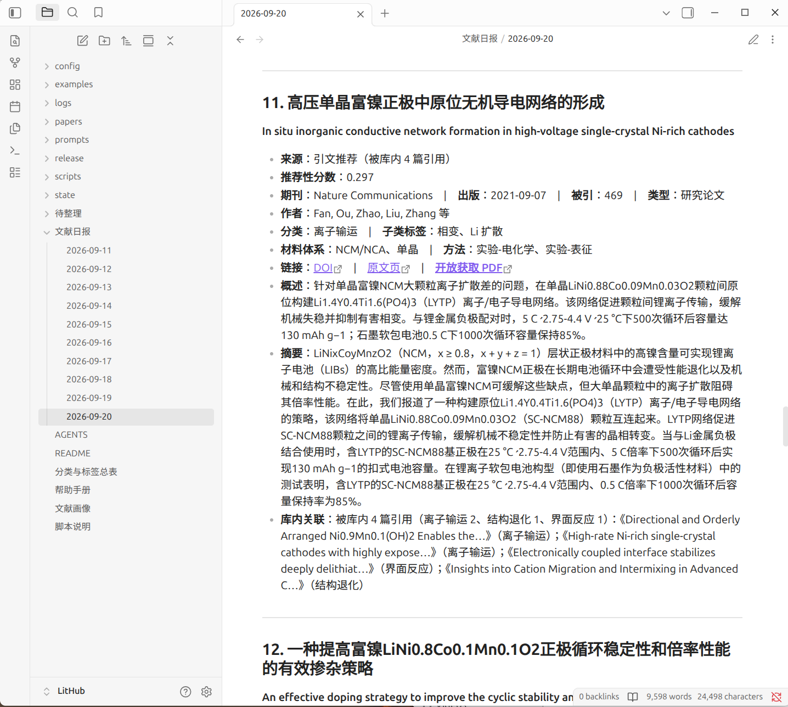

> **📦 你正在看的是发布包里的一份。** 这个目录必须放到 `~/LitHub` 才能跑——
> 把**本目录整个改名/移动**成 `~/LitHub`（不是在里面直接跑，见仓库根目录的 README）。
> `linux/` 与 `windows/` 两份的**代码完全相同**，区别只在文档。

# LitHub — 本地文献流水线



<sub>↑ 它每天产出的东西：中文标题、打分排序、分类与标签、中文概述与摘要，以及「被库内哪几篇引用」的关联。一份 Markdown，Obsidian / 邮件 / 浏览器都能读。</sub>

把 **Zotero 文献库**、**MinerU 文档转换** 和一个 **LLM CLI** 串成一条可续跑、幂等的流水线：
自动追踪某个研究方向的文献、读全文、写中文总结、按你的分类体系整理进 Zotero，
每天出一期带排序的文献日报。

> 面向「一个人 + 一个 Zotero 库 + 一条 cron」，不是多人服务。
> 所有脚本只用 Python 标准库，没有 `requirements.txt`。

## 它做什么

| 环节         | 脚本                                       | 说明                                                               |
| ---------- | ---------------------------------------- | ---------------------------------------------------------------- |
| 收编 PDF     | `intake_pdfs.py`                         | 按首页 DOI 匹配库里条目，缺则用 CrossRef 建条目，三段式上传 PDF 到 Zotero               |
| 转 Markdown | `mineru_batch.py`                        | 调 MinerU 精准模式，产出 `paper.md` + `images/`（公式、表格、图都保留）              |
| 中文总结       | `summarize_batch.py`                     | 每篇一个独立 LLM 会话，按 `prompts/summarize.md` 模板写 `summary.md`          |
| 挂回 Zotero  | `link_markdown.py`                       | 把 `paper.md` / `summary.md` 作为 linked_file 附件挂到条目上（Obsidian 也能读） |
| 分类与标签      | `apply_to_zotero.py`                     | 按 `classification.json` 写入分类目录与各标签轴                              |
| 主动检索       | `find_new.py`                            | 按库内分类检索库外新文献，产出候选清单                                              |
| 每日文献日报     | `daily_digest.py`                        | 三个通道取候选，按打分公式选出 N 篇，产出 `文献日报/YYYY-MM-DD.md` 与 `.urls.txt`        |
| 日报发信       | `send_digest.py`                         | 把当天的日报作为纯文本邮件发出（配置在 `runtime.json`，**零 token**）                  |
| 引文图 / 画像   | `citation_graph.py` / `build_profile.py` | 共被引图（日报的引文通道靠它）、主题分布与时间趋势统计                                      |
| 库内文献打分     | `score_library.py`                       | 给库内每篇算「推荐分」，写进 Zotero 的 Extra 字段（**零 token**）                    |
| 清理         | `tidy.py`                                | 空条目 / 重复条目 / 孤儿目录 / 空分类目录，默认只报告，`--apply` 才动手                    |

## 和同类工具比，不一样在哪

**① 不只是「通知你有新论文」，而是把文献整理进你的库。**
多数同类工具（`zotero-arxiv-daily`、`Paper-Agent-Zotero` 这类）做到「每天推一批论文」就停了。
LitHub 会继续往下走：读全文 → 写中文总结 → 按你自己的分类法写回 Zotero 的分类目录与多轴标签，
并且把 `paper.md` / `summary.md` 挂成条目附件。半年后你的库是能查的，不是一堆未读条目。

**② 领域配置外置，换研究方向不用 fork 代码。**
分类法、每类的检索式、判分关键词、相关性闸门正则、期刊白名单全在 `config/topic.json`；
频率、篇数、检索池、打分权重、发信在 `config/runtime.json`。
（⚠️ 但**代码里还剩几处领域硬编码**，见下面「限制」第 2 条。）

**③ 幂等 + 可续跑。**
每个脚本都是「做完的跳过、断点续跑」。日报的成本大头是网络请求，靠分级缓存把重跑变成零网络；
总结的模型调用按 DOI 缓存，重跑零花销。

**④ 有零 token 的部分。**
文献画像（时间趋势、方法学缺项、被引网络）和库内「推荐分」都是纯统计 + 免费接口，不调 LLM。
真正花钱的只有日报翻译（约 2 分/天）和逐篇中文总结。

**⑤ 文档密度。**
`帮助手册.md` 2200+ 行 + `AGENTS.md`，里面是一份**踩坑实录**，不是功能介绍：
MinerU 的 401 token 报错文案不可信（真因通常是复制的 key 不完整）、
Zotero 本地 API 写条目时字段**必须平铺**否则 HTTP 200 但静默不改、
IPv6 黑洞会让同一个请求从 0.7 秒变成 181 秒……

## ⚠️ 先说清楚它做不到什么

**① 下文献仍然要你自己动手。这是最省不掉的一环。**
日报会给出 DOI 和出版方链接，**开放获取的直接给 PDF**；但**付费墙后面的拿不到**——
Elsevier、Wiley、Springer Nature 的正刊，脚本去抓一律吃 403 或 HTTPError，只能靠校园网或图书馆。
你要自己点开下载，丢进 `待整理/`，再跑收编。
（OpenAlex / Unpaywall / Europe PMC / 出版社页面这几条路我都试过，对这几家的付费刊基本无效；
实测数据与「找 PDF 的有效顺序」写在 `帮助手册.md` §7 末尾。）

**② 换研究方向仍要改代码。**
`config/topic.json` 装下了大部分领域内容，但代码里还剩几处硬编码——
最硬的一道是 `daily_digest.py` 的 `LAYERED_PAT`（标题或摘要不命中就直接丢弃）。
不改就会一直按作者的方向（锂离子电池层状氧化物正极）筛。
完整清单按符号名列出，见 `帮助手册.md` §4.2，先改前三处管线就能跑通。

**③ 第一次上手要手工写分类表。**
`state/classification.json` 是逐篇的分类结果，没有脚本能替你生成——每收编一篇就要补一条
（`primary` / `sub` / `method` / `materials` …）。库大了之后这是常态工作量。
「入库」的判据也不是挂个 PDF 就算，要跑到 `mineru_batch.py` + `summarize_batch.py`。

**④ 单人本地工具。**
没有服务端、没有多人协作、没有 Web 界面。项目**必须**放在 `~/LitHub`（脚本里写死了这个根目录），
`state/` 里存着本机绝对路径，**挪动目录会让附件链接失效**。

**⑤ 依赖几个外部服务。**
Zotero 桌面版（要保持运行）、MinerU token、一个 LLM CLI（默认 kimi）、
以及 Crossref / Unpaywall / OpenAlex 的礼貌池邮箱。
其中 OpenAlex 2026 起按请求计费（匿名池每天约 100 次），年报任务会用到。

**⑥ 没有测试。**
一个测试文件都没有。脚本靠「幂等 + 每步先 `--dry-run`」来兜，改动后请自己验证。

**⑦ 输出以中文为主。**
日报、中文总结、画像都是中文；分类标签也大量用中文。给非中文读者用需要自己改提示词与标签。

## 平台支持

| 平台 | 状态 |
|---|---|
| **Linux** | ✅ 作者主力环境，**已实测** |
| **macOS** | ⚠️ 应该可用（纯标准库 + 同样的外部 CLI），**未实测** |
| **Windows** | ⚠️ **代码已适配，但作者没有 Windows 机器、未实测**。已处理：文件与子进程的 UTF-8 编码、Windows 命令行 32767 字符上限（超了自动降级）、路径分隔符。详见 [`docs/windows.md`](docs/windows.md)——也可以直接用 **WSL2** 原样跑 Linux，零改动 |

**Windows / macOS 上第一次用，先跑这一条：**

```bash
python scripts/doctor.py
```

它会逐项检查 Python 版本、四个外部命令（`mineru-open-api` / `pdfinfo` / `pdftotext` / `gs`）、
LLM CLI、Zotero 本地 API、写授权密钥，并做一次**中文编码自检**（写一个含中文的临时文件再读回来比对）——
缺什么、怎么装，它都会直接说。

> 仓库带了一份 GitHub Actions 冒烟测试（`.github/workflows/ci.yml`），在 Ubuntu 与 **Windows**
> 上编译全部脚本、并做编码往返自检。但**「CI 绿」不等于流水线能通**——Zotero / MinerU / LLM
> 都是本地服务，CI 里没有，它测不到。整条链路只能在真机上按 `docs/windows.md` 手工验。

## 从这里开始

**新来的先读 [`帮助手册.md`](帮助手册.md) 的 §1** —— 一条照着做就能跑通的路径，
约 30 分钟能看到第一个成果（一篇 PDF 变成 Zotero 里带中文总结的条目）。

| 想做什么             | 看哪里                              |
| ---------------- | -------------------------------- |
| 第一次跑起来           | `帮助手册.md` §1                     |
| 换成我自己的研究方向       | `帮助手册.md` §4（**含代码里剩余的领域硬编码清单**） |
| 查参数 / 调日报权重      | `帮助手册.md` §6                     |
| Zotero 本地 API 的坑 | `帮助手册.md` §7                     |
| MinerU 转换的坑      | `帮助手册.md` §8                     |
| 出错了              | `帮助手册.md` §10 故障速查               |
| 项目内部约定与实现决策      | `AGENTS.md`                      |

**前置**（详见手册 §3）：Python 3.12+（无第三方包）、Zotero 桌面版保持运行并打开
「允许其他应用与本机 Zotero 通信」、MinerU CLI 配好 token、一个 LLM CLI。

## 样例

`examples/NatureComm_2024_grain-level-chemo-mechanics/` 是一篇 **CC BY 4.0** 开放获取论文
经本流水线处理后的完整产出（`paper.md` + `summary.md` + 图），用来说明输出长什么样。
其余论文一律不进仓库（`state/`、`papers/`、`文献日报/` 同理）。

## 许可

**代码与文档 MIT**（见 `LICENSE`）：`scripts/`、`prompts/`、`*.md` 都适用。

**仓库不包含任何论文原文。** `examples/` 下的样例是一篇开放获取（CC BY 4.0）的期刊论文，
其正文与图片的著作权归原作者与出版方，按 CC BY 4.0 的条款再分发，**不受 MIT 许可覆盖**——
使用时请保留出处与许可声明。
